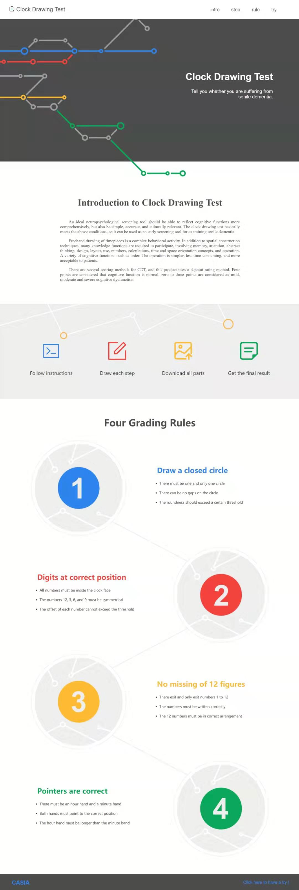
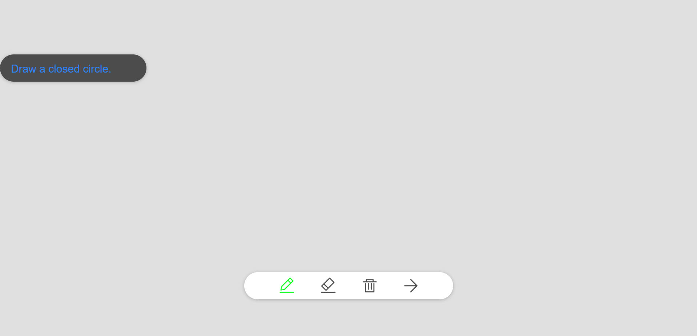

# Clock Drawing Test

This is a [Clock Drawing Test](https://en.wikipedia.org/wiki/Executive_dysfunction#Clock_drawing_test) scoring system implemented with html, css, javascript and python, which is based on ajax + django design framework and mvc design pattern.

## Introduction

The clock test is a simple, high-accuracy and culturally relevant deafness screening test that comprehensively reflects cognitive function, and can be used as an early screening tool for examining senile dementia.

Freehand drawing of timepieces is a complex behavioral activity. In addition to spatial construction techniques, many knowledge functions are required to participate, involving memory, attention, abstract thinking, design, layout, use, numbers, calculations, time and space orientation concepts, and operation order. In all, A variety of cognitive functions are in need.

The clock test has a variety of score tables. The system uses a 4-point system, which are:

- A closed circle

- Scales located inside the circle and evenly distributed

- Numbers evenly distributed in the circle and arranged in 1 - 12 order

- The hour and minute hands pointing to the correct time (specified by the tester)

## Dependencies

- [OpenCV](https://opencv.org/) :

`pip install opencv-python`

- [Numpy](https://numpy.org/) :

`pip install numpy`

- [Django](https://www.djangoproject.com/) :

`pip install Django`

Make sure you can run the following statements in your Python 3 shell:

```
import numpy
import cv2
import django
```

## Usage

- Dependencies

Ennsure installation of python3, django, opencv and numpy.

- Download/clone this repo

Download this repo directly or use the command : ```django-admin startproject CDT``` to build a django project and copy all folders and files into it.

! Note : CDT backend should be placed in judge folder. It is up to the enduser to create a proper pipeline that accepts staged clock drawings at clock face, hands, and digits level.

- Enter the follow command in cmd

```python manage.py runserver 0.0.0.0:8000``` to start the local server.

- Start project in browser

Enter ```127.0.0.1:8000/index/``` in the address bar of your browser, and the index page will be shown.



- Usage of CDT testing

Clicking the Demo link will lead you to the sketch page, which is a drawing board. Follow instructions to get a result.



## <span id="design">Design Idea</span>

I adopt the MVC design pattern for this test. This repo just implements the view and controller as well as custom backend.

Structure of catalog is as follows:

```
- CDT
    - __init__.py
    - settings.py
    - urls.py
    - view.py
    - wsgi.py
- data
- judge
- static
    - css
        - index.css
        - sketch.css
    - img
        - bin_select.png
        - bin.png
        - eraser_select.png
        - eraser.png
        - index.png
        - next_select.png
        - next.png
        - pen_select.png
        - pen.png
        - rule_one.png
        - rule_two.png
        - rule_three.png
        - rule_four.png
        - step_one.png
        - step_two.png
        - step_three.png
        - step_four.png
        - symbol.png
    - js
        - index.js
        - jquery-3.4.1.min.js
        - sketch.js
- template
    - index.html
    - sketch.html
- manage.py
```

The CDT folder is the framework of this project. [\_\_init__.py](CDT/__init__.py) and makes other scripts recognize this as a package. [settings.py](CDT/settings.py) defines the basic path of template pages, static files including images, css, js and so on. [urls.py](CDT/urls.py) defines all pages in this project, each page corresponds to a function in view. [view.py](CDT/view.py) defines three pages, index is the index page, sketch is the drawing board and save is the controller. [wsgi.png](CDT/wsgi.png) manages the web server which helps you run this application.

The initial data folder is empty.

The judge folder stores the grading program.

The static folder is unique for django. Generally, the images, css files, js files be called by templates in django are stalled in this folder, and the path of static files are specified in settings.

The template folder stores the static web pages which are written in HTML. And the basic address is defined in settings. Note: All pages are static files included in django project should be imported through absolute path.
[manage.py](manage.py) manages the status of the whole project.

Now, let's have a look at some design details.

This product uses canvas to do rendering. I have packeted some functions to draw circles and lines to eliminate repetitive code usage.

```
function Draw_Line(pen, start_x, start_y, end_x, end_y) {
    pen.beginPath();
    pen.moveTo(start_x, start_y);
    pen.lineTo(end_x, end_y);
    pen.stroke();
}

function Draw_Circle(pen, center_x, center_y, radius, start_angle, end_angle) {
    pen.beginPath();
    pen.arc(center_x, center_y, radius, start_angle, end_angle);
    pen.stroke();
}

function Fill_Circle(pen, center_x, center_y, radius, start_angle, end_angle) {
    pen.beginPath();
    pen.arc(center_x, center_y, radius, start_angle, end_angle);
    pen.fill();
}
```

Pen is set as follows.

```
var content_pen = document.getElementById("content_canvas").getContext("2d");
content_pen.strokeWidth = 6;
content_pen.lineWidth = 6;
content_pen.strokeStyle = '#2d85f0';
```

Drawing board is set to match browser dimensions.

```
canvas.width = document.documentElement.clientWidth;
canvas.height = document.documentElement.clientHeight;
```

I eliminate scroll bars and lock the page for a cleaner and simpler UI.

The canvas is converted to base64 encoded image format string, and sent to the server.

The front end is as follows.

```
image_data = canvas.toDataURL("image/png").substr(22);
```

And the server end is.

```
import base64

image_data = request.POST.get('img_info')
img_data = base64.b64decode(image_data)
file = open('img.png',"wb")
file.write(img_data)
file.close()
```

In this way, the canvas from the user end can be stored in the server end. For larger images, `POST` is employed instead.

```
$.ajax({
    type: 'POST',
    url: '/save/',
    data: {
        'img_info': image_data,
        'img_id': image_id,
        'time_hour': hour,
        'time_minute': minute,
    },
    success: function(data) {
        if (data >= 0) {
            alert('You get ' + data + ' points!');
            window.location.href = "../index";
        }
    }
});
```

We employ CSRF parameter for proper function of the request. ```csrfmiddlewaretoken: $("[name='csrfmiddlewaretoken']").val()``` and in the template add something like this : ``````. For more detail, refer to the developer doc [https://docs.djangoproject.com/zh-hans/2.1/](https://docs.djangoproject.com/zh-hans/2.1/).

A subprocess is used to execute the outer program which stored in [judge/](judge/).

```
import render
import subprocess

cmd = 'cd.. && '
cmd += 'cd judge && '
cmd += 'python -m CDT imgs/1.png imgs/2.png imgs/3.png'
execmd = subprocess.Popen(cmd, shell = True, stdin = subprocess.PIPE, stdout = subprocess.PIPE)
point = execmd.wait()

return HttpResponse(point)
```

This returns the score.