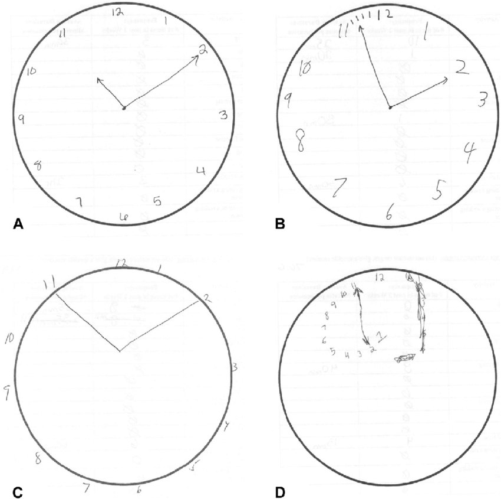
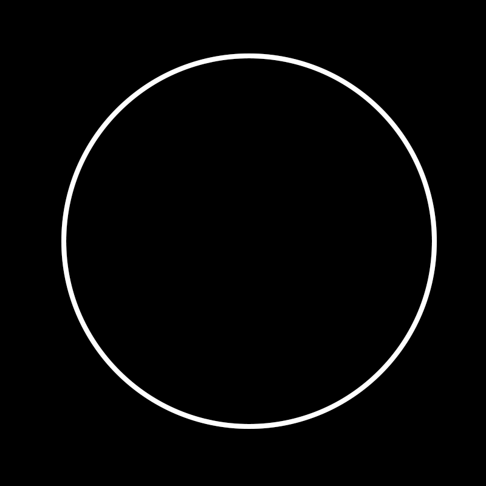
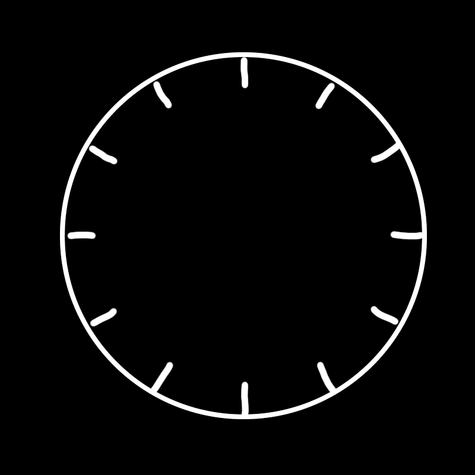
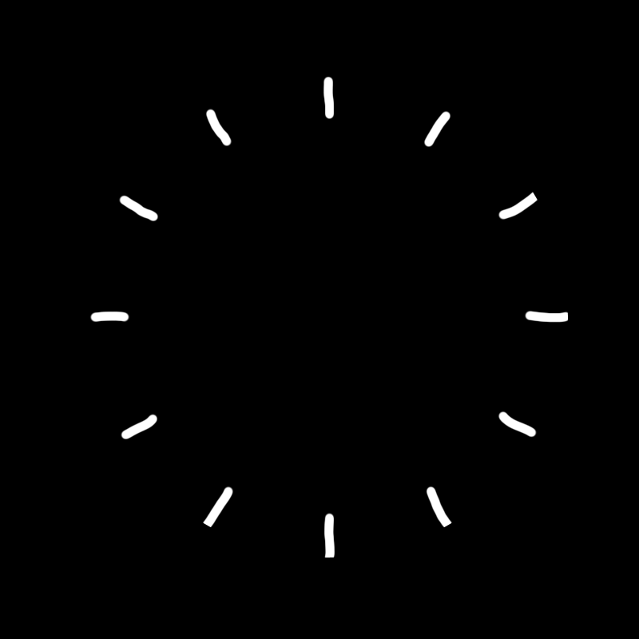
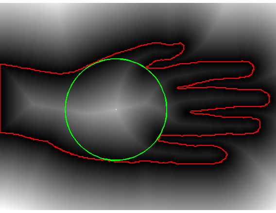
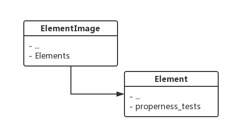
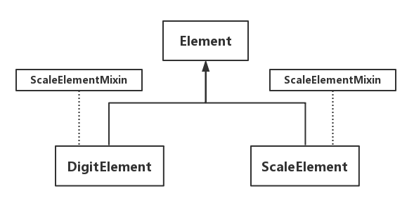
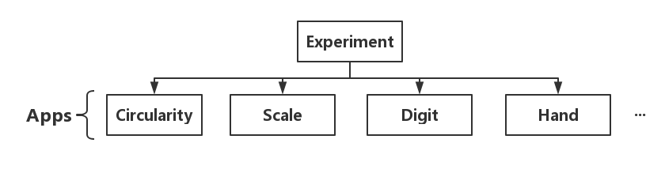

# 画钟测试

一个用 Python 3 (3.7.0) 实现的[画钟测试（Clock Drawing Test）](https://en.wikipedia.org/wiki/Executive_dysfunction#Clock_drawing_test)评分系统。


### 目录

- [背景介绍](#bg)
- [依赖](#dependencies)
- [维护与开发](#dev)
    - [虚拟环境](#1)
    - [交互方式](#2)
    - [输入图像](#3)
        - [输入图像预处理](#3-1)
    - [计分思路](#4)
        - [第一分](#4-1)
        - [第二分](#4-2)
    - [包与模块](#5)
        - [包与模块目录](#5-1)
    - [数据模型](#6)
    - [函数式编程思想](#7)
        - [Python函数式编程介绍](#7-1)
            - [Map-Reduce处理](#7-1-1)
            - [用Filter函数筛选](#7-1-2)
            - [用Zip函数为数据附加信息](#7-1-3)
            - [用Partial函数定制行为](#7-1-4)
        - [高阶函数、装饰器与闭包](#7-2)
        - [应用函数式编程和装饰器制作`App`和`Element`](#7-3)
        - [函数式编程与面向对象编程的矛盾](#7-4)
    - [惰性求值](#8)
        - [为什么需要惰性求值](#8-1)
        - [惰性求值的实现](#8-2)
        - [带来的问题](#8-3)
    - [单例模式](#9)
        - [为什么需要单例模式](#9-1)
        - [单例模式的实现](#9-2)
        - [思考：原型编程](#9-3)
    - [Mix-in模式](#10)
        - [为什么需要Mix-in模式](#10-1)
        - [Mix-in模式的实现](#10-2)
        - [基于Mix-in模式重新思考数据模型](#10-3)
        - [思考：Mix-in、面向切面编程和元编程](#10-4)
    - [消费者模式、迭代器和协程](#11)
    - [测试](#test)
        - [模拟测试数据](#test-create_img)
        - [单例模式带来的问题](#test-singleton)
    - [未来扩展](#mirai)
        - [输入图像预处理](#mirai-preprocessing)
        - [计分思路](#mirai-scoring)
        - [并发](#mirai-multi)
- [后记](#ps)


## <span id='bg'>背景介绍</span>

画钟测试是一项简单易行，准确性高而且文化相关性小，全面地反映认知功能的失智症筛查测试，可作为检查老年性痴呆的早期筛查工具。

徒手画钟表是一个复杂的行为活动，除了空间构造技巧外，尚需很多知识功能参与，涉及记忆、注意、抽象思维、设计、布局安排、运用、数字、计算、时间和空间定向概念、运作的顺序等多种认知功能。

画钟测试有多种计分表，本系统采用4分制，分别为：

- 封闭的圆
- 位于圆内并且均匀分布的刻度
- 位于园内均匀分布，并且按 1 - 12 顺序排列的数字
- 指向正确时间（由测试方指定）的时针与分针




## <span id='dependencies'>依赖</span>

- [OpenCV](https://opencv.org/):

`pip install opencv-python`

- [Numpy](https://numpy.org/):

`pip install numpy`

确保在你的 Python 3 shell 中可以运行以下语句：

```python
import numpy
import cv2
```


## <span id='dev'>维护与开发</span>

### <span id='1'>虚拟环境</span>

你可能会想在开发中使用虚拟环境安装这些依赖。我个人推荐使用 [pyenv](https://github.com/pyenv/pyenv) 和 [pyenv-virtualenv](https://github.com/pyenv/pyenv-virtualenv).


### <span id='2'>交互方式</span>

本系统希望使用半交互方式进行画钟测试，换而言之就是由系统给出文本提示，然后交由受测者完成并提交进行下一步。

流程示例：

**请画出一个封闭的圆作为钟表盘** → *用户画出圆并提交下一步* → **请在画出钟表的时间刻度** → *用户画出刻度并提交下一步* → **请画出钟表的时间刻度对应数字** → *用户画出数字刻度并提交下一步* → **请在钟表上画出指向「指定时间」的时针和分针** → *用户画出时针和分针并提交下一步* → *显示最终评分*

（粗体字代表系统显示的文本提示，斜体字代表用户或系统的行为）


### <span id='3'>输入图像</span>

每一次获得新的图像，与上一步的图像进行差集操作，以获得每一步的图像，再将每一步的图像作为输出进行评分。

图示：





#### <span id='3-1'>输入图像预处理</span>

本系统的交互方式可以在不同的平台上实现，只要提供给系统一个生产队列即可。举例说明，可以使用Web网页显示文本提示和下一步按钮，并且提供一个Canvas画板供受测者作画。这样做的好处是，图像不需要过多的预处理，而且本身就可以是二值图。但是从另一个角度说，这种做法会给受测者带来一定的操作门槛和麻烦，并且鼠标作画相比纸笔作画（特别是对于高龄受测人群），准确度不可避免的会有所下降。

另一种可行的方法（特别是在有协助者在场，如医院等应用场景）就是使用拍照上传作为与系统的交互手段。在这种方式下，系统不与受测者直接沟通。作为代替，由协助者代替系统传达作画提示，并且将受测者的作画上传至系统进行评分。这种做法和上面所提到的做法相反，给受测者带来了诸多便利，并且尽量与人工测试提供的环境和体验保持一致，但是相反就需要对拍照的图像进行一定的预处理。

图像的预处理是一个庞大的问题，背后牵扯诸多细节。鉴于本系统不过多涉及交互部分与细节，这里仅提供部分基础的图像预处理方案方便用户按需取用，更多扩展方案详见[未来扩展 – 输入图像预处理](#mirai-preprocessing)。

本系统提供的预处理方案：

- 二值化
- 开闭操作
- 舍弃内部面积过小的轮廓图形（防止笔误）

### <span id='4'>计分思路</span>

*\* 目前本系统只实现了前两分的评分，详见[未来扩展 - 计分思路](#mirai-scoring)。*

#### <span id='4-1'>第一分 - 封闭的圆</span>

利用圆是同等周长下面积最大的图形这一特质进行圆度计算。可以使用轮廓长度（即周长）比轮廓面积（即面积）计算，也可以使用最大内切圆与轮廓面积的比计算。如果圆度超过阈值，则认为通过。

轮廓长度与轮廓面积均可通过OpenCV内置的轮廓函数计算得出。而内切圆则需要复杂一点的计算。求内切圆时，遍历图形轮廓内的所有点，并且计算每个点到轮廓的最短距离。距离最大的点则为内切圆圆心，距离则为内切圆半径。

具体应用时，先用轮廓创建一个蒙版（Mask），然后在蒙版上应用[距离变换（Distance Transform）](https://en.wikipedia.org/wiki/Distance_transform)，求出轮廓内的距离场，得到一个包含所有距离的列表，然后选取最大值。

图示：



#### <span id='4-2'>第二分 - 位于圆内并且均匀分布的刻度</span>

将表盘最大内切圆12等分，取每一份扇形的中间部分作为刻度的区域。如果一共仅有12个刻度元素，并且12个区域内均有且仅有一个刻度，则认为通过。

评分时，系统认定只要一个刻度元素重心位于扇形的中心区域内，并且至少两个最小外接矩形的顶点位于扇形内，即可判断为位于扇形的中心区域内。同时按顺序遍历12个扇形和按照时钟顺序排序的刻度元素，依次判断是否一一对应。

评估一个指定点是否在给定区域时，可以使用OpenCV提供的`pointPolygonTest`函数，用于判断一个指定点和一个给定轮廓的空间关系。


### <span id='5'>包与模块</span>

#### <span id='5-1'>包与模块目录</span>

以下为本项目的完整目录（排除README及相关图片等文件）：

```
- apps
    -circularity
        circularity.py
        tests.py
    -scale
        scale.py
        tests.py
    app.py
    tests.py
- excepts
    lazy_excepts.py
    mixin_excepts.py
- imgs
    ...
- models
    - model_mixins
        image_mixin.py
        scale_element_mixin.py
        scale_image_mixin.py
        tests.py
    - scale
        scale_element.py
        scale_image.py
    circle.py
    clock_face.py
    element.py
    element_image.py
    tests.py
- utils
    - metas
        meta_mixin.py
        meta_singleton.py
        meta_singleton.mixin.py
        tests.py
    create_imgs.py
    lazy_property.py
    mixin_template.py
    subscribe_methods.py
    tests.py
CDT.py
experiment.py
image_generator.py
image_loader.py
settings.py
tests.py
```

简化为目录（加粗的为核心目录）：

<pre>
<b>- apps</b>
    - circularity
    - scale
<b>- models</b>
    - scale
    clock_face.py
- experiment.py
- CDT.py
</pre>

显而易见，`apps`包中包含了`circularity`和`scale`这两个提供模块化测试的包，而`models`包中包含了提供`scale app`所需的数据模型的`scale`包和提供钟表表盘数据模型的`clock_face.py`。

#### <span id='5-2'>架构模式</span>

从上面的目录不难看出，本项目采取的是[MVC架构模式](https://zh.wikipedia.org/wiki/MVC)。其中，`View`部分预期由客户程序完成（如上文提到的Web网页画板），而在本项目中则由`CDT.py`提供简易的命令行交互界面。`Model`部分代表程序操作的数据模型，譬如`ClockFace`, `ElementImage`, `Element`, `Circle`等。针对这些数据模型进行操作的便是评分系统。在本项目中，评分系统根据每一分的得分要求细分模块化为多个`App`，最后由`Experiment`对象进行统一的调用和整体评估，得出最终的分数。这里便是身为桥梁，沟通`Model`和`View`的`Controller`部分。

在良好的职责分离，高内聚低耦合的MVC模式下，本项目得以为各个部分独立进行单元[测试](#test)。项目整体的可测试性，可扩展性，可维护性皆有所保障。


### <span id='6'>数据模型</span>

如上文所提，本项目是基于MVC模式开发，完成了`Model`和`Controller`两部分，`View`可部分交由客户程序完成。所以本项目的重点在于对数据模型的操作评估上。这里介绍一下本项目所使用的数据模型。

本项目获得的输入是客户点击n次下一步后得到的n张输入图像（n为`App`的数量），是同上一张输入图像（如果存在）进行差值操作得到的，针对单独每一步的输入图像，其中只会包含每一个`App`所需的元素。针对这一特性，我们首先创建一个`Element`父类表示所有的元素。与此同时，每次得到的输入图像中常常包含不止一个元素（如12个刻度，12个数字，2个指针），所以实际使用时一般是对一个`Element`序列进行操作，而不是对单个`Element`进行操作。因此，我们又需要一个对`Element`序列进行包装的对象`ElementImage`。



除此之外，有一个特殊情况便是身为第一个`App`的`Circularity`，表盘圆度评估。表盘圆度评估并不存在单个的元素或者元素序列，仅仅是对单一的圆形进行评估。当然你可能会产生疑问，难道单一圆形不能够作为元素，然后让整个`ElementImage`仅作为一个元素的序列包装吗。这里要考虑到一个问题，就是后续的其他`App`的评估离不开表盘和表盘近似圆（比如刻度评估需要12等分表盘进行），这就意味着`ClockFace`对象不能够像其他的钟表元素一样独立存在。

因此，我们将`ClockFace`作为特例，不计入`ElementImage`中作为子类，而是作为一个单独的对象。同时，由于需要提供针对表盘的一系列接口方便对其他`ElementImage`对象进行评估，但是开放`ClockFace`这个特殊的“元素图”给同级的其他`ElementImage`对象并不是一个好的做法，所以我们需要一个代理对象，让`ClockFace`和其他同级的`ElementImage`对象都可以访问，来提供表盘的圆形信息，也就是`Circle`对象的由来。

`Circle`对象作为一个抽象的圆形，我们剥离了其身为表盘的属性，作为一个单纯的几何图形看待，这样就避免了破坏同级模块之间的封装，依然维持了仅由各自上级模块进行操作的初衷。对于各个`ElementImage`对象来说，`ClockFace`对象依然是同级的被封装的黑盒子，他们仅能够访问上级模块提供的`Circle`对象（虽然这个`Circle`对象由`ClockFace`对象提供，但是并不由`ClockFace`对象直接交予同级的`ElementImage`对象，而是通过上级模块作为沟通的桥梁，维持了信息的隐藏封装），然后依此评估各自的`Element`对象。但是实际上，这个问题并没有被如此简单的就完美解决，详见[惰性求值 - 带来的问题](#8-3)

`Element`对象自身保留一系列自评估方法，用于完成所有不需要除了`Circle`对象以外的所有外界信息（比如其他`Element`对象的位置）的评估。这种类型的自评估包括刻度元素的位置评估。同时，有时候需要把`Element`元素序列进行近一步的排序和归类，比如按照空间关系进行顺时针排序，还有如将10,11,12这三个时间数字的六个元素（因为OpenCV会认为一个数字是一个图形，并不能够将它们按照数字逻辑归类）打包到一起成为三个时间再交由上级模块评估，就要由对`Element`序列进行包装的`ElementImage`来完成。最后，在评估元素的时候，有时候需要其他元素的参与，譬如数字12的1和2要作为整体进行评估，这些需要按需联系多个元素进行同时评估的任务，不能交由元素自评估（1和2都分别不清楚对方的存在），就交由上层的`App`对象通过访问`ElementImage`来完成。这就是本项目的任务分级制度。

对于评估元素，这里需要澄清一下`Circle`以防误解。如上文所提，我们希望`Circle`仅仅作为一个圆的对象，剥离其对于钟表的意义。但是事实上，`Circularity - ClockFace - Circle`这样的模型是符合`App - ElementImage - Element`的模式的。这个特例特殊的地方就在于，本来应该由身为`Element`位置的`Circle`对象来进行自评估圆度的行为，由于我们希望剥离`Circle`身为几何图形以外的含义（也就是说我们实际上不认为`Circle`是一种`Element`），被转移到了身为`App`模块的`Circularity`中了。这样子是一个对于特殊情况的妥协。既没有破坏现有封装，也在稍微牺牲语义的基础上维持了现有的模型结构。

当然，对于这个问题还有一种颇为可行的解决方案就是，制作一个`ClockFaceElement`类作为`Element`，然后使用`Circle`类作为一个代理包装一下`ClockFaceElement`类，隐藏其身为钟表元素的所有行为和属性，然后封装成一个纯几何图形`Circle`向外提供一系列接口。这样使用代理类`Circle`，既保持了封装（其他`Element`对象依然只能得到一个纯几何图形`Circle`），又完美保持了模型的`App - ElementImage - Element`结构和语义。不过我的个人理解是，鉴于我们在使用Python而不是Java，添加代理类解决这种结构上的小瑕疵不符合我们的Python以简洁为本的编程思想，于是就选择了上面的方案。


### <span id='7'>函数式编程思想</span>

本项目中虽然是以面向对象编程和一些Java的编程思想为基本，也不乏大量的[函数式编程（Functional Programming）](https://en.wikipedia.org/wiki/Functional_programming)思想运用。其中以Python提供的一系列函数式编程函数为首，包括了`map`，`reduce`，`filter`，`partial`，`zip`等，配合Python自身对于函数对象的处理和编程思想，完成了大量功能。函数式编程的代表语言[Lisp](https://en.wikipedia.org/wiki/Lisp_(programming_language))，名称源自"LISt Processor"。无论对于Lisp还是Python，列表都是一个重要的数据结构。在动态类型语言下，配合Python“一切都是对象”的设计哲学，列表变得无比强大。除了传统意义上的保存一系列数据以外，Python的列表也可以保存一系列行为（函数对象）。这里我们先简单介绍上面5个Python提供的函数式编程函数，后面的内容也会或多或少涉及，不过这里不过多阐述。

#### <span id='7-1'>Python函数式编程介绍</span>

一般对于数据的处理，我们可以抽象为一个`map`后接`reduce`的一个过程。`map`代表的是对数据的一系列预处理，预处理行为被`map`到每一个列表的元素上。`reduce`代表的是数据的归纳，将一整个列表的元素归纳处理成为结果。在函数式编程时，我们会需要大量用到`lambda`匿名函数来配合各种操作，同时Python的“一切都是对象”的特性也会变得重要，因为函数也是一个对象，可以作为参数代表要进行的行为传递给其他函数。

#### <span id='7-1-1'>[Map-Reduce处理](https://en.wikipedia.org/wiki/MapReduce)</span>

示例：

```python
# 对一系列数据进行取整操作，然后求和

...

# datas = [ 1.1, 2.2, 3.3, 4.4, 5.5 ], sum = 1 + 2 + 3 + 4 + 5 = 15
sum = reduce(lambda res, nxt: res + nxt, map(lambda n: int(n), datas))
```

上面是一个最简单基本的`map-reduce`处理的应用。与此同时，我们可能对于数据的要求不仅仅在于统一处理，可能还需要筛选，这时候就轮到`filter`函数派上用场了。

#### <span id='7-1-2'>用Filter函数筛选</span>

示例：

```python
# 对一系列数据进行取整操作，然后求所有奇数的和

...

# datas = [ 1.1, 2.2, 3.3, 4.4, 5.5 ], sum = 1 + 3 + 5 = 9
sum = reduce(lambda res, nxt: res + nxt, filter(lambda n: n % 2, map(lambda n: int(n), datas)))
```

上面我们在`map`的基础上又筛选了一遍所需元素，然后再交由`reduce`归纳出我们需要的结果。

#### <span id='7-1-3'>用Zip函数为数据附加信息</span>

实际应用的情况下，我们处理的数据可能并不是像上面一样简单的一个一元列表。往往我们可能会有两个列表同时需要处理，比如说一个元素列表和一个行为列表，然后把行为列表中的行为应用到元素列表中的对应元素上进行预处理，然后再进行归纳操作。这时候我们会需要`zip`函数来将两个一元列表转化成一个二元列表，其中新列表的每个元素都是分别来自两个列表中的元素。如：`zip([ 1, 2, 3 ], [ 4, 5, 6 ])`会得到一个新的数组`[ (1, 4), (2, 5), (3, 6) ]`。

示例：

```python
# 对一系列数据分别进行指定的的操作，然后求所有数据的和

add_one = lambda n: n + 1
minus_one = lambda n: n - 1

...

# 定义了一个行为列表
behaviors = [ add_one, add_one, minus_one, minus_one, add_one ]

# 先取整所有数据，然后和行为列表组合，进行数据各自的预处理（加一或减一），然后求和
# datas = [ 1.1, 2.2, 3.3, 4.4, 5.5 ], sum = (1 + 1) + (2 + 1) + (3 - 1) + (4 - 1) + (5 + 1) = 16
sum = reduce(lambda res, nxt: res + nxt,
             map(lambda d_b: d_b[1](d_b[0]),
                 zip(map(lambda n: int(n), datas),
                     behaviors)))
```

当然，除了上面这种`zip`数据列表和行为列表的情况，我们也有时候会`zip`两个数据列表，另一个列表作为处理所需的附加信息。使用`zip`函数可以为原有的列表添加一个新的等长的信息列表，并将信息列表中的信息附着在原有的数据列表元素上，从而可以通过附加信息帮助处理数据。

示例：

```python
# 按照年龄为人物排序
names = [ 'A', 'B', 'C' ]
ages = [ 11, 19, 17 ]

# n_names = [('A', 11), ('C', 17), ('B', 19)]
n_names = n_names = sorted(zip(names, ages), key=lambda name_age: name_age[1])

# unzip n_names
# n_names = [ 'A', 'C', 'B' ]
n_names = list(zip(*n_names)[0])
```

#### <span id='7-1-4'>用Partial函数定制行为</span>

刚才的示例还是不能让我们满意，因为代码并不简洁。如果可以定义一个函数`add_minus_one`，然后增加一个参数作为判断要加还是要减，我们就可以只定义一个函数，然后增加代码复用性了。这时候，就到了偏函数功能`partial`的用武之地了。偏函数`partial`根据传入的一个函数对象和参数，返回一个设定好参数默认值的新函数。如：`print_hello = partial(print, 'helloworld')'`会得到一个新的函数`print_hello()`，用于打印`'helloworld'`。

之前我们一直在集中讨论关于数据的各种处理，现在`partial`给我们提供了一个新的方向，那就是对行为，对函数的一个处理。为了达到最终的目的，无论是数据还是行为都需要一定的预处理，这样才能让它们相互最适合，在最后的`map-reduce`中发挥最大的作用。

示例：

```python
# 对一系列数据分别进行指定的的操作，然后求所有数据的和

add_minus_one = lambda add, n: n + 1 if add else n - 1

...

# 定义了一个行为列表，让奇数位为minus_one，偶数位为add_one
behaviors = [ partial(add_minus_one, i % 2) for i in range(5) ]

# 先取整所有数据，然后和行为列表组合，进行数据各自的预处理（偶数加一奇数减一），然后求和
# datas = [ 1.1, 2.2, 3.3, 4.4, 5.5 ], sum = (1 - 1) + (2 + 1) + (3 - 1) + (4 + 1) + (5 - 1) = 14
sum = reduce(lambda res, nxt: res + nxt,
             map(lambda d_b: d_b[1](d_b[0]),
                 zip(map(lambda n: int(n), datas),
                     behaviors)))
```

#### <span id='7-2'>高阶函数、装饰器与闭包</span>

Python允许的对于行为的处理远不止`partial`函数一个。因为函数在Python中是一级对象，可以如同其他变量一样使用和作为参数传递，我们可以在Python中利用[高阶函数（higher-order function）](https://en.wikipedia.org/wiki/Higher-order_function)达到更多的行为定制。高阶函数的定义是满足**接受一个或多个函数作为输入**或者**输出一个函数**中至少一个条件的函数。

```python
# 包装一个函数，让它在被调用的时候打印提示信息

...

def print_call(func):
    def wrapper(*args, **kwargs):
        print(func.__name__ + ' called.')
        return func(*args, **kwargs)
    return wrapper

f = print_call(f)
```

上面的代码中我们制作了一个高阶函数`print_call`，它接受一个函数作为输入，把他包装成`wrapper`函数，并且将包装后的结果函数返回，这样以后调用函数`f`的时候就会打印提示语句了。

同时，这里我们使用了Python提供的特性`*, **`来帮助传递函数收到的所有位置参数和关键字参数。除此之外，这段代码中体现了Python有关函数式编程思想的两个核心特性。一个是上文多次提到的“一切都是对象”，函数对象在这段代码中犹如普通的变量一样被参数传递，使用，赋值等，与`int`等对象并无区别。另外一个关键特性就是Python对于[闭包（Closure）](https://en.wikipedia.org/wiki/Closure_(computer_programming))的支持。

闭包，又称函数闭包，指引用了自由变量的函数，这个被引用的自由变量将与函数一同存在，即是离开了这个环境也一样。用一句话来概括闭包就是“函数只与被创造的变量环境绑定，不与被引用的变量环境绑定”。闭包基于语言将函数当做第一类对象这一特性，一般出现在当一个子函数在另一个函数中被定义时。比如上面的这段示例代码中，`wrapper`函数在`print_call`函数中创建，所以绑定`print_call`函数中的环境。换句话说，`wrapper`函数可以使用变量`func`。即使`print_call`函数在全局环境中被调用创建`wrapper`，或者函数`f`被使用在任何其他地方，都不会影响`wrapper`函数对于变量`func`的权限，因为它们已经在创建的时候就被绑定了。

需要注意的是，当你在外部打印`f.__name__`时，会显示`wrapper`。这是因为实际上`print_call`函数返回的已经不是原先的`f`函数了，而是`wrapper`函数。也就是说这样的包装结果会是一个函数签名和原函数一模一样的新函数。更严谨的方式来说，是一个签名和原函数一模一样的`callable`对象。为什么这么说呢，是因为`print_call`函数也可以返回函数以外的对象，只要这个对象有实现`__call__`方法，并且其签名和`f`相同。

示例：

```python
# 包装一个函数，让它在被调用的时候打印提示信息

...

def print_call(func):
    class wrapper():
        def __init__(self, func):
            self.func = func

        def __call__(self, *args, **kwargs):
            print(self.func.__name__ + ' called.')
            return self.func(*args, **kwargs)
    return wrapper(func)

f = print_call(f)
```

对于上面的包装函数，Python提供了更为方便的语法糖，也就是[装饰器（Decorator）](https://wiki.python.org/moin/PythonDecorators)。使用装饰器我们可以把上面的代码简化美观。

示例：

```python
# 包装一个函数，让它在被调用的时候打印提示信息

def print_call(func):
    def wrapper(*args, **kwargs):
        print(func.__name__ + ' called.')
        return func(*args, **kwargs)
    return wrapper

@print_call
def f():
    ...
```

对于函数式编程思想的应用，本项目较为保守，并不是一个完全基于函数式编程思想的程序。本项目大体上还是基于Java的一套面向对象编程思想进行设计，只是在一些细节部分利用Python提供的诸多便利做出了改动。

在应用函数式编程思想的时候，一个很重要的部分就是要求函数不能带有副作用，只能通过参数和返回值的传递来进行信息的传递，不能够在函数内改变任何值。在这样的基础上，每个函数都只获得输出并输出处理后的数据，使得函数之间形成一种[管道（Pipeline）](https://en.wikipedia.org/wiki/Pipeline_(software))结构（上一个函数的结果是下一个函数的输入，函数之间组合连接成为一个水管一般的结构）。我们将不同的行为划分为一个个小的函数作为计算子，然后通过包装，组合，传递等一系列操作来契合我们的`map-reduce`。这其中就要求函数不能带有副作用，否则会破坏其作为管道的纯粹性。

#### <span id='7-3'>应用函数式编程和装饰器制作`App`和`Element`</span>

接下来我们要把上面的内容应用到我们的项目中，这其中主要体现在我们的`App`和`Element`类中。这两个类分别掌管元素的统一评估和自评估两个操作，这其中必然伴随着一系列评估方法帮助得到结果，而如何将这些评估方法优雅地组合起来就需要应用这些技巧了。理想的做法是，我们能让这些类自己动态的将自己的评估方法添加到一个列表中，然后对这个列表应用`reduce`操作得到最后的结果。同时，这个动态添加方法的过程还需要能够区分评估方法和其他的成员方法。为了实现上面的功能，我们需要一个类作为方法列表的包装，然后把这个类用作装饰器来实现评估方法的注册功能。我们把这个功能包装成一个工具模块。

[subscribe_methods.py](../utils/subscribe_methods.py)：

```python
class subscribe_methods():
    """
    The subscribe_methods decorator. Used to create a list and subscribe
    multiple methods into it for later calls.
    """
    def __init__(self, func, func_list=None, trigger_name=''):
        self.func = func
        self.__doc__ = getattr(func, '__doc__')
        self.name=  func.__name__
        self.func_list = func_list or []
        self.trigger_name = trigger_name or self.name

    def add_method(self, func):
        """
        Add the method into methods list.

        @param method func
        @return subscribe_methods decorated method
        """
        self.func_list.append(func)
        return type(self)(func, self.func_list, self.trigger_name)

    def __get__(self, instance, cls=None):
        """
        The descriptor protocol of python. When the list method is visited,
        return the methods list instead.

        @return list methods list
        """
        if instance is None:
            return self
        if self.name == self.trigger_name:
            return self.func_list
        return partial(self.func, instance)

    def __call__(self, *args, **kwargs):
        return self.func(*args, **kwargs)
```

通过使用`subscribe_methods`类，我们可以用`@subscribe_methods`装饰器来创建一个方法列表，并使用像`@methods.add_method`这样的方式来注册评估方法。最后，在我们需要这些方法的时候，我们直接使用通过改写过`__get__`方法成为一个函数列表的`self.methods`成员即可。

原有的`App - ElementImage - Element`模式不需要做出任何改变。我们为所有的`App`类创建共同的父类。创建共同的父类的目的是统一并规范化所有的`App`对外提供的接口。这样上层模块在拿到一个`App`对象时就可以直接通过它的`__call__`方法遍历它的评估方法并且得到结果了。这个过程就借助我们上面实现的`subscribe_methods`来完成。实现代码如下。

[app.py](../apps/app.py)：

```python
class App():
    ...

        def __call__(self):
        """
        Run the app.

        @return True if passed
        """
        return reduce(lambda res, mtd: res and mtd(self,
                                    type(self)._ELEMENT_IMAGE(self._raw_img)),
                      [ True ] + self.methods)
```

在这里我们简单的定义了`__call__`方法作为一个接口。而在这其中我们用`reduce`批处理方法列表中的所有评估方法，归纳得出结果并返回。

至于`Element`对象，也是统一向外提供一个`__call__`方法用于遍历所有的自评估方法，然后得到自评估的结果。

[element.py](../models/element.py)：

```python
class Element():
    ...

    def __call__(self, circle):
        """
        Run all the properness tests and return the result.

        @param Circle circle: inscribed circle of clock face
        @return True if passed
        """
        return reduce(lambda res, test: res and test(self, circle),
                      [ True ] + self.properness_tests)
```

上面的两个父类直接规定了子类中的方法列表装饰器的名字。其中在`App`中它被限制为`methods`，而在`Element`中它是`properness_tests`。下面是一个子类实现的例子。

[circularity.py](../apps/circularity/circularity.py)：

```python
class Circularity(App, metaclass=MetaSingleton):
    ...

    @subscribe_methods
    def methods(self):
        pass

    @methods.add_method
    def _inscribed_circle_mtd(self, clock_face):
        ...

    @methods.add_method
    def _perimeter_area_mtd(self, clock_face):
        ...
```

这样在子类中就完成了评估方法的实现和整合，而父类定义的接口也可以借此访问所有的评估方法。


#### <span id='7-4'>函数式编程与面向对象编程的矛盾</span>

虽然说不带副作用的函数有诸多好处，但是这也不能避免的带来了一些问题。这之中最大的问题就是不带副作用的函数与面向对象编程思想中方法之间的差异。我们知道一个类可以简单理解成为一个数据结构与其相关方法的集合体。类的一系列方法大多都是基于类成员的数据进行一系列操作的。举个最简单的例子，Python的list类，提供了一系列针对列表的行为方法如`append`，`pop`，`remove`等，并且这些方法大多都是带有副作用的，这也是面向对象编程中方法对于类的意义所在，将能对数据进行的一系列操作暴露给客户。而我们上面一再强调，函数不能带有副作用，但是一旦与面向对象编程相结合，两套编程哲学的矛盾便暴露出来了。具体一点来说就是，我们如果不能把类方法的结果体现在类成员数据的改变上，我们难道每次需要这个数据的时候都要计算一遍吗。这一点主要体现在不带参数的类方法上，因为每次计算的结果都是相同的，但是又不能将其的结果更新体现在类成员变量上。

（当然，这个问题并不完全是因为函数式编程，只是当我们需要大部分的方法都不带副作用时，特别是不带参数的方法们，这个需求问题变得极为尖锐。）

示例：

```python
# 传统面向对象做法
class Human():
    ...
    def choose_suitable_career(self, hobby):
        self.career = # 根据爱好选择最合适的职业

# 用户
someone = Human()
someone.choose_suitable_career('coding')
# 使用someone.career进行之后的各种操作

# 用户2也可以直接使用someone.career进行操作

# 不带副作用的做法
class Human():
    ...
    def choose_suitable_career(self, hobby):
        return best_career # 将结果返回

# 用户
someone = Human()
best_career = someone.choose_suitable_career('coding')
#使用best_career进行之后的操作

# 用户2需要重复上面的行为
```

这个问题的结果就是引出了下一节，[惰性求值](#8)的运用。


### <span id='8'>惰性求值</span>

Python等主流语言使用的求值策略都是[及早求值（Eager Evaluation）](https://en.wikipedia.org/wiki/Eager_evaluation)，也就是说一个表达式在被约束到变量的时候就会立刻求值。

示例：

```python
a = get_a() # get_a在运行到这里的时候就被调用了
```

#### <span id='8-1'>为什么需要惰性求值</span>

这样的策略固然在某些方面是更有效率的，因为不需要管理存储表达式结果的中介数据结构，直接赋值给变量即可。但是这样的求值策略在一些场景下会带来巨大的性能问题。比如下面的[数据库ORM（Object-relational Mapping）](https://en.wikipedia.org/wiki/Object-relational_mapping)代码

示例：

```python
# 一个数据库ORM
class DatabaseORM():
    def __init__(self, ...):
        self._database = # 连接数据库

    ...

# 用户类
class User():
    def __init__(self, ...):
        self._orm = DatabaseORM(...)

    ...
```

上面的Python代码会带来一个问题，因为要维护一个底层数据库对象，而且为了方便操作数据库的连接放到了类的初始化中；如有甚者，可能会把读表等行为也写在初始化方法中。这样会导致类在被初始化的时候就需要进行一系列的I/O费时操作，带来的不必要的开销，因为往往初始化的时候并不一定是需要立刻获得其中数据的时候。这时候，为了推迟这个求值过程，解决这个问题，可以改进代码。

示例：

```python
# 一个数据库ORM
class DatabaseORM():
    def __init__(self, ...):
        self._database = None

    # 只有在需要的时候再由客户类连接
    def connect(self):
        self._database = # 连接数据库

    ...

# 用户类
class User():
    def __init__(self, ...):
        self._orm = DatabaseORM(...)

    def use_data(self):
        # 使用时再连接
        self._orm.connect()

    ...
```

虽然新的代码很大程度上解决了原有的问题，但是也带来了新的问题。首先，`DatabaseORM`类需要向用户类暴露更多底层细节，并且`connect`方法的调用时机由用户类掌控，带来了不必要的负担，我们只是需要`_database`成员在被需要的时候才初始化，在这之前求值表达式挂起不运行就行。应这样的要求下，使用[惰性求值（Lazy Evaluation）](https://en.wikipedia.org/wiki/Lazy_evaluation)的求值策略完美符合我们的要求。惰性求值又称按需求调用，不在表达式被绑定到变量之后就立即求值，而是在该值被取用的时候求值。用以下的Python伪代码表示：

```python
# 一个数据库ORM
class DatabaseORM():
    def __init__(self, ...):
        self._database = # 此处惰性求值

    ...

# 用户类
class User():
    def __init__(self, ...):
        self._orm = DatabaseORM(...)

    def use_data(self):
        self._orm.get_data() # 此时才连接数据库，为_database成员求值

    ...
```

使用惰性求值的求值策略，代码变得简洁易用，而且解决了性能的痛点。

那么理解了惰性求值之后，再回到我们的项目中。我们之前说的问题是，调用了类的方法之后，这些方法身为没有副作用的存在，并不能够将计算的结果体现在类成员变量的改变上，导致用户程序需要自行保存计算结果，而且如果换个用户类，新的用户需要再次进行计算。为了解决这个问题，我们同样需要惰性求值策略。

我们在项目中，把大部分的类都纯粹化成为一种数据结构，而不是数据和行为的结合体。这些数据结构提供大量可以访问的惰性求值成员变量，然后用户类直接通过访问这些惰性求值的成员变量来得到自己需要的信息。惰性求值类变量就是一个作为保存这些没有副作用的类方法计算结果的中介。

#### <span id='8-2'>惰性求值的实现</span>

当然，上面的这段Python伪代码是没有办法运行的，因为Python默认并不提供惰性求值，所以需要我们自己按需实现。在本项目中，我们利用了上文提到的函数装饰器来实现惰性变量，将一个不带参数的类方法包装。在这个类方法被第一次调用之后，保存其结果，然后之后的调用自动返回之前的结果。这里我们需要利用Python的[描述器协议（Descriptor Protocol）](https://docs.python.org/3/howto/descriptor.html)。不同于类装饰器的是，描述器需要实现对象的`__get__`方法，用以覆盖访问该成员时的操作。

通过装饰器和描述器对目标方法进行包装，当第一次访问成员时，`__get__`会运行成员所代表的方法，然后将这个值代替原有的函数对象写入到类的成员字典中并返回结果，这样下次访问这个成员时，它就已经是一个普通的成员变量了。换句话说，在访问它之前，类成员字典是：`{ 'lazy_property': <function object> }`，但是在这之后由描述器替换成`{ 'lazy_property': <result of evaluation method> }`。具体实现如下。

[lazy_property.py](../utils/lazy_property.py):

```python
class _LazyProperty():
    """
    Decorator that converts a method with a single self argument into a lazy
    evaluated property
    """
    def __init__(self, func, name=None):
        self.func = func
        self.__doc__ = getattr(func, '__doc__')
        self.name = name or func.__name__

    def __get__(self, instance, cls=None):
        """
        Call the function and put the return value in instance.__dict__ to
        implement lazy property
        """
        if instance is None:
            return self
        res = instance.__dict__[self.name] = self.func(instance)
        return res

lazy_property = _LazyProperty

# 使用场景
class DatabaseORM():
    @lazy_property
    def database(self):
        # 连接数据库

    ...
```

这样我们就解决了最基本的惰性求值需求，但是还没有结束。为了满足我们对于方法不带副作用的需求，有时一个方法可能会产出多个结果，这时一个惰性求值已经无法满足我们的需求了。

示例：

```python
a, b, c = self._get_val()
# 将这条赋值表达式转化为惰性求值
```

上面的代码中，`a, b, c`三个变量共享同一个初始化方法`_get_val`。如果按照上面的做法分别将这三个变量用描述器和装饰器包装成为惰性求值变量的话，会需要调用`_get_val`方法三次，明显因小失大。所以这里我们需要的功能是，将`a, b, c`这三个变量串联起来，其中任何一个被使用到的时候（也就是被求值的时候），另外两个同伴变量也必须随之被赋值，但是如果任何一个变量都没有被访问的时候，则延迟求值不变。

基本思路依然是基于描述器来把类方法包装成惰性求值的成员变量，但是我们需要这三个描述器之间有所沟通，维护一个列表用于保存`_get_val`的运行结果。当一个成员变量被访问的时候，首先查看这个列表是否为空。如果不为空，那么返回对应的值并且改写类的成员字典对应的值。如果这个列表为空，那么调用保存好的求值函数`_get_val`进行求值并且更新列表的元素。为了使得描述器之间能够共用同一个列表，并且能在列表更新的第一时间得到结果，最简单的办法便是使用类变量来维护这个列表而不是实例变量。

此时会出现一个新的问题，那就是如果使用类变量来维护结果列表的话，我们只能够创建一组`multi_lazy_properties`，不然使用别的求值函数的惰性求值变量们会污染现有的结果列表，因为大家使用的都是同一个类，自然也访问的是同一个类变量。为了解决这个问题，我们依然需要Python的“一切都是对象”的特性，因为类也是一个对象。类作为实例的模板，常理来说不应该是对象才对。但是在Python中，所有的类都有一个共同的模板`type`类。也就是说Python中的所有类都是基于`type`类派生的对象。如果在Python中尝试以下代码会容易理解这点：

```python
type(instance_of_C) # <class 'C'>
type(C) # <class 'type'>
type(type) # <class 'type'>
```

不难理解，类`C`是派生自`type`类的对象，而`instace_of_C`则是派生自类`C`的对象。

鉴于这层关系，我们只需要为每一组`multi_lazy_properties`从`type`类中重新派生一个新的`multi_lazy_properties`类即可。这样即使每组的惰性变量在组内共享同一个类变量作为结果列表，也不会和其他组发生冲突。

实现代码如下。

[lazy_property.py](../utils/lazy_property.py):

```python
class _MultiLazyProperties():
    """
    Decorator that links methods with a single self argument and use same
    initializing function together and converts them into lazy property.

    i.e. all of the property values would only be evaluated after at least one
          of them is used.
    """
    def __init__(self, func, name=None):
        self.func = func
        self.__doc__ = getattr(func, '__doc__')
        self.name = name or func.__name__

        type(self).name_list += [ self.name ]

    def add(self, func):
        """
        Add a new property.
        """
        return type(self)(func)

    def function(self, func):
        """
        Add the initializing function. The function must return same amount of
        values as that of the properties, and must take at most one argument
        (self or cls).
        """
        type(self).result_func = func
        return func

    def _make_result_name_list(self, caller):
        """
        Call the evaluation function and zip the properties' name list and
        result list together.

        @param instance / class caller: caller of the evaluation function
        @return 2-d list name-value pair list
        """
        result = type(self).result_func(caller) if \
                                    type(self).result_func.__code__. \
                                    co_argcount else type(self).result_func()

        if not len(result) == len(type(self).name_list):
            raise LazyPropertyError

        return zip(type(self).name_list, result)

    def __get__(self, instance, cls=None):
        """
        Call the function and put the return value in instance.__dict__ to
        implement lazy property.
        """
        if instance is None:
            return self

        if not self.name in instance.__dict__:
            for name, val in self._make_result_name_list(instance or cls):
                instance.__dict__[name] = val

        return instance.__dict__[self.name]


def multi_lazy_properties(name=''):
    return type(name + '_multi_lazy_properties', (_MultiLazyProperties, ),
                                                 dict(name_list=[],
                                                     result_func=None))


# 使用场景
class ThreeVals():
    @multi_lazy_properties('a')
    def a(self):
        pass

    @a.add
    def b(self):
        pass

    @a.add
    def c(self):
        pass

    @a.function
    def get_val(self):
        return a, b, c
```

除了之前介绍过的内容以外，这段代码中还使用了Python的自省功能。因为惰性求值既可以发生在类变量，实例变量，或者全局变量上，所以我们需要允许求值函数可以为类方法（只有一个参数`cls`），实例方法（只有一个参数`self`），或静态函数（没有参数）。因此，我们需要判断求值函数接收多少参数，并按需传入。这点通过Python的`func.__code__.co_argcount`完成，它返回一个函数接收的参数数量。

#### <span id='8-3'>带来的问题</span>

惰性求值看起来很美好，但是在实际运用的时候也会带来一些不可避免的问题。比方说上文提到过的`Circle`类。`Circle`对象本应该是由`ClockFace`产生的用于计算圆度的副产品，但是同时其他的`ElementImage`对象也需要利用`Circle`对象来帮助各自元素的评估。因此，我们明显需要将`Circle`对象作为参数传入各个`ElementImage`的初始化器中，作为成员变量。为了不破坏这个顺序，并且将`Circle`对象的创建留在`Circularity`的评估时，我们不能够写下面这样的代码。

Python伪代码：

```python
# ElementImage
class ElementImage():
    def __init__(self, circle, ...):
        self._circle = circle

    ...

# 初始化ElementImage的时候
element_image = ElementImage(clock_face.circle, ...)
```

按照这个方式写的话，如果`ElementImage`的初始化位于`Circularity`的评估操作之前，就会导致`Circle`对象在被`Circularity`模块使用之前就被创建，但这时候并不需要使用这个值，因为逻辑上整个程序第一次需要用到`Circle`对象是在`Circularity`的评估操作，在此之前的任何求值操作都是不必要的。在这里随着`ElementImage`的初始化而创建的`Circle`对象并没有立刻投入使用。所以根据我们之前的经验，这里需要使用惰性求值。

Python伪代码：

```python
# ElementImage
class ElementImage():
    def __init__(self, clock_face, ...):
        self._clock_face = clock_face

    @lazy_property
    def inscribed_circle(self):
        return self._clock_face.inscribed_circle # ClockFace的inscribed_circle也是惰性求值变量

    ...

# 初始化ElementImage的时候
element_image = ElementImage(clock_face, ...)
```

虽然这里使用惰性求值解决了`Circle`对象在需要前被求值的问题，但是又带来了结构上的问题。之前我们费尽心思就是为了将`ClockFace`对象向其他同级的`ElementImage`对象隐藏，但是上面的代码明显破坏了这一初衷，导致我们功亏一篑。为了解决这个问题，我们需要用到下一节的知识点[单例模式](#9)。


### <span id='9'>单例模式</span>

在上一节中我们提出了对`Circle`对象应用惰性求值策略所带来的信息隐藏问题，因为我们不能够直接将`Circle`对象作为参数传递给`ElementImage`类的初始化器，只能退而求次传入`ClockFace`对象，然后再通过`ClockFace`对象访问惰性求值变量`clock_face.inscribed_circle`来达到惰性求值的目的，但是这种做法破坏了我们的封装结构。为了解决这个问题，我们只好放弃将`Circle`对象作为参数传入给`ElementImage`类的初始化器，此时一种方案是考虑使用全局变量代为实现。

#### <span id='9-1'>为什么需要单例模式</span>

但是所有人都知道，全局变量的使用有诸多弊端，会污染变量作用域，带来很多问题，所以很明显使用全局变量也不是一个好的选择。这时候我们就需要考虑使用[单例模式（Singleton Pattern）](https://en.wikipedia.org/wiki/Singleton_pattern)来维护我们的`Circle`对象了。

在我们的项目中，有些对象是全局仅存在一个的，譬如我们的表盘`ClockFace`对象，`Experiment`对象，各个`App`对象，各个`ElementImage`对象，还有`Circle`对象等。除此之外，我们还可能在程序的任何一个地方需要这个实例（比如各个`ElementImage`都会需要使用到`Circle`对象），然而我们并不想使用会污染作用域的全局变量来保存这些实例。或者说，有一个对象要作为其他对象的原型来使用（[原型编程（Prototype-based Programming）](https://en.wikipedia.org/wiki/Prototype-based_programming)）。上述三种情况都是可以应用单例模式的场景。

应用单例模式时，一个单例对象的类必须保证只有一个实例存在。如果用户试图创建新的实例，那么用户只能得到已有的那个实例，而不是获得一个新的复制或新的实例。

示例：

```python
# 创建单例类
class Singleton():
    ...

# id(obj1) == id(obj2)
obj1 = Singleton()
obj2 = Singleton()
```

#### <span id='9-2'>单例模式的实现</span>

为了应用单例模式，我们需要用到Python的特性[元类（Metaclass）](https://docs.python.org/3.3/reference/datamodel.html)。之前我们介绍过了Python中类，实例，与`type`类之间的关系，这里的元类就是进一步的实际运用。我们知道Python中的类都是`type`类的实例，而`type`类身为所有类的模板，也如同其他类一样，可以拥有子类，而继承自`type`类的子类就是我们的元类。换句话说，Python中的元类和`type`一样，也是类的模板，只不过是可以自定义的类的模板。

我们通过创建元类`MetaSingleton`，改写通过应用`MetaSingleton`创建的类的`__new__`方法，来达到单例类的目的。实现代码如下。

[meta_singleton.py](../utils/metas/meta_singleton.py)：

```python
class MetaSingleton(type):
    """
    The metaclass for singletons.
    """
    # instances list, store the instantiated singleton instances
    _instances = {}

    def __call__(cls, *args, **kwargs):
        """
        When instantiating, check the instances list if a singleton instance
        already exists. If so, return the existing instance, else create a new
        one and return.

        @return object instance for singleton class
        """
        if cls not in cls._instances:
            cls._instances[cls] = super(MetaSingleton, cls).__call__(*args,
                                                                     **kwargs)
        return cls._instances[cls]
```

在元类`MetaSingleton`中，我们使用一个类变量字典`_instances`来保存单例类的实例。当一个单例类要被实例化的时候，我们查找该字典当中是否已经存在一个实例化好的对象。如果存在，则返回已有对象。如果没有，则创建一个新的实例并将其保存到字典中。下面是应用代码。

示例：

```python
# 定义单例类
class Singleton(metaclass=MetaSingleton):
    ...

# id(obj1) == id(obj2)
obj1 = Singleton()
obj2 = Singleton()
```

通过应用单例模式，我们将`Circle`定义为一个单例类，因为确实一个钟表上只有一个代表表盘的圆形。并且通过使用单例模式，我们达成了各个`ElementImage`共享`Circle`对象，而不破坏其求值顺序（一定在最先使用`ClockFace`的`Circularity`中求值）的目的。当然，单例模式的应用也不是高枕无忧的，具体详见[测试 - 单例模式带来的问题](#test-singleton)和[未来扩展 - 并发](#mirai-multi)。

#### <span id='9-3'>思考：原型编程</span>

现在我们接触的大多面向对象编程都是基于类进行的。以类作为模板，用来创造实例化多个对象，然后每个对象大致相互独立。在Python中这点很明显，因为一切都是对象，就连我们的类也是基于`type`（和继承`type`的元类）实例化得到的对象。然而并不是每一个面向对象语言都是这样的，其中最广为人知的特例便是JavaScript了。

在像JavaScript和IO这样的语言中，对象并不是基于类实例化得到的，而是通过复制其他对象产生的。换句话说，在这些语言当中的对象，可以被简化理解成为一个字典，作为一个`slots`存在。而与此同时，我们可以随意更改`slots`中的内容，添加或者删除成员，又或者是基于现有的`slots`复制得到一个新的`slots`。这样的不同的背后就是原型编程。

在上文讨论单例模式的应用场景时我们稍微提了一下原型模式，但是并没有给出任何的解释说明。原型模式是“明确一个实例作为要生成对象的种类原型，通过复制该实例来生成新的对象”的编程方式。

只有在动态类型语言中，原型模式才能体现自身的价值。当我们思考类存在的意义的时候，往往会解释说类时实例的模板，为实例提供一系列限制和规范。换个角度讲，类也就是数据的类型，对象则是这个类型的一个值。打个比方，数字`1`明显是一个`int`型的变量，但如果`int`就是一个类（比如在Python中一样），那么数字`1`也可以称作是`int`类的一个实例，这点可能在静态语言中有所区别（有时这些语言会通过[Boxing-Unboxing](https://docs.microsoft.com/en-us/dotnet/csharp/programming-guide/types/boxing-and-unboxing)来向你隐藏这一事实），因为它们会将`int`这样的数据做成[值类型](https://en.wikipedia.org/wiki/Value_type_and_reference_type)，然后把实例作为[引用类型](https://en.wikipedia.org/wiki/Value_type_and_reference_type)的数据。但是在Python这样的语言中没有值类型和引用类型的区别。更甚一步来说，Python这样的动态类型语言根本没有对于类型的诸多限制。这样的特性导致相比静态类型语言，在动态类型语言中类和实例之间的 类型 - 值 关系变得极其不重要。

诚然，我们在Python中可以使用传统的面向对象编程进行类的定义和实例化。

示例：

```python
# Human类是所有人类实例的模板，也就是规定了类型
class Human():
    def eat(self):
        return 'eating'

# Worker类继承了Human类，作为Human的一种特例
class Worker(Human):
    def work(self):
        return 'working'

# 实例化一个Worker对象
someone = Worker()
someone.eat() # 'eating'
someone.work() # 'working'
```

不过除此之外，Python提供了可以充当`slots`的类成员字典`__dict__`属性，这让我们有了一个新的方式定义一个对象。

示例：

```python
# Human类是一个单例类
# 其唯一的实例会作为Human对象的雏形供复制使用
class Human(metaclass=MetaSingleton):
    def eat(self):
        return 'eating'

    def clone(self):
        return copy.deepcopy(self)

# id(human) != id(worker) != id(someone)
human = Human()
worker = human.clone()
worker.__dict__['work'] = lambda : 'working'
someone = worker.clone()

someone.eat() # 'eating'
someone.work() # 'working'
```

原型编程有着惊人的灵活性和可扩展性，可以随意的为复制雏形得到的对象添加新的属性。而且，原型编程与传统静态类型语言中的面向对象相比，更关注`i have`而不是`i am`的概念。换句话说，原型编程更注重对象有哪些成员，而不是这个对象实例化自哪个类。


### <span id='10'>Mix-in模式</span>

#### <span id='10-1'>为什么需要Mix-in模式</span>

对于像Java这样的语言来说，继承有着两种含义。一种是实现的继承（在Java中用`extends`继承，只能是单一的），一种是规格的继承（在Java中用`implements`继承，可以指定多个）。Java中的接口对于实现没有任何限制，可以是任何没有继承关系的类来实现。在需要多重继承的情况下，使用实现继承（`extends`）会带来多重继承的复杂性，其中包括查找优先级，结构复杂化，还有功能冲突等一系列问题。而规格的继承（`implements`）则有着不能共享实现的缺点。

同时，在像Python这样的动态语言中，存在着[鸭子类型（Duck Typing）](https://en.wikipedia.org/wiki/Duck_typing)的概念。鸭子类型源于一句话，“走起路来像鸭子，叫起来也像鸭子，那么它就是鸭子”。这背后的意义是，只关心行为而不关心类型。对于一个对象，我们只关心它有什么样的行为，而不在意它派生自什么类。举例来说，只要一个列表中的所有元素对象都实现了`__call__`方法，那么我们就可以写出这样的代码：`[ e() for e in e_list ]`，不管`e_list`列表中到底装的是什么。

换句话来说，对于动态语言，我们不需要有像Java这样的静态语言一样的接口和类型的限制，只要对象遵循协议实现了所需要的行为即可。同时，为了实现上面讨论的多重继承，而一定程度上避免两种方式各自的问题，在动态语言中我们可以选择应用[Mix-in模式](https://en.wikipedia.org/wiki/Mixin)。

Mix-in是具有不能单独生成实例，也不能继承普通类的特点的一种抽象类，定义了一系列带有实现的行为，用于在需要的时候“插入”目标类，从而完成具有实现共享的规格继承，这点契合了动态语言中的鸭子类型概念。使用Mix-in时按照以下规则，通常的继承使用单一继承，第二个开始的父类需要是Mix-in的抽象类。

我们可以把Mix-in看做是一种特殊的多重继承，但是语义上与多重继承有所区别。这是因为继承关系的两个类存在`is-a`关系（如`Human is Mammal`），但是Mix-in看重的是行为（如`Human can eat`）。下面的Python伪代码阐释了Mix-in的应用。

示例：

```python
class AnimalEatMixin(Mixin):
    def eat(self):
        # eat

class Human(Mammal, AnimalEatMixin):
    ...

class Frog(Amphibia, AnimalEatMixin):
    ...
```

在上面的代码中，我们使用单一继承来做语义上的一般继承（is-a），然后使用Mix-in完成剩下的共享实现的规格继承，并且由于鸭子类型的存在，我们依然可以用相同的方式使用`Human`类和`Frog`类的行为。与此同时，相比定义一个更大的`Animal`类，简化了继承结构，相比一般的多重继承，解决了语义不符的查找优先级的问题。并且使用Mix-in抽象类符合软件设计的[DRY原则](https://en.wikipedia.org/wiki/Don%27t_repeat_yourself)，使得`Human`类和`Frog`类共享了实现。通过使用Mix-in抽象类，我们可以将行为功能模块化，并且随时插入需要的类，这一过程简单高效而美观。

#### <span id='10-2'>Mix-in模式的实现</span>

Python中默认没有提供Mix-in这一功能。当然使用多重继承也可以模拟Mix-in的基本功能，但是语义上就不符合了（因为用户类和Mix-in抽象类没有任何is-a关系）。所以我们为了将Mix-in模式投入使用，需要自己编写一个工具来为类插入Mix-in抽象类的功能，并且保证这个过程不会对继承结构有任何改变。

为了实现这个功能，我们又需要使用前文提及的元类，来定义使用Mix-in类的用户类的模板。我们在根据`MetaMixin`模板元类创建用户类的时候，将Mix-in抽象类中的所有方法抽取出来并注入到用户类当中，这样就保证了Mix-in仅继承功能的纯粹性和扁平性。具体实现代码如下。

[meta_mixin.py](../utils/metas/meta_mixin.py)：

```python
class MetaMixin(type):
    """
    The metaclass for mixins. User classes should set this as metaclass, and
    add the mixins into the mixins list.
    e.g. class User(metaclass=MetaMixin, mixins=(Mixin1, Mixin2)):
    """
    def __new__(cls, name, bases, classdict, mixins):
        """
        Add the attributes from mixin classes to the user class when creating
        a new class from this metaclass.

        @param type mixins: the mixin classes
        @return type user classes created
        """
        # create a new class from type
        rclass = super().__new__(cls, name, bases, classdict)

        # add attributes
        for mixin in mixins:
            [ setattr(rclass, attr_name, getattr(mixin, attr_name)) \
                    if not attr_name in rclass.__dict__ else None
                    for attr_name in mixin.__dict__.keys() ]

        return rclass


# 使用场景
class ScaleImage(ElementImage,
                 metaclass=MetaMixin, mixins=(ScaleImageMixin, )):
    ...
```

在元类`MetaMixin`中，我们改写了其`__new__`方法来改变其创建类时的行为。在创建类时，我们先基于`type`创建类，然后再将Mix-in类的成员全部注入到创建好的类的成员字典中，然后再返回注入好的类，这样就实现了在Python中织入Mix-in的元类。

在定义Mix-in抽象类的时候需要继承`Mixin`父类，用来为Mix-in抽象类的行为提供模板。如我们定义的`ScaleImageMixin`。

[scale_image_mixin.py](../models/model_mixins/scale_image_mixin.py)：

```python
class ScaleImageMixin(Mixin):
    ...
```

#### <span id='10-3'>基于Mix-in模式重新思考数据模型</span>

现在我们有了Mix-in这一强大的武器，再回来重新思考改进原来的数据模型。之前我们提到过`App`、`ElementImage`和`Element`类的实现，他们都规定了各自的模型需要提供的接口。但是我们发现这还不够，时钟的刻度元素（`ScaleElement`）与时间数字的元素（`DigitElement`）在判断是否每个扇形的中心区域都有且仅有一个元素的自评估操作上是共通的。这两个`Element`对象都继承自父类`Element`，而这部分行为并不应该存在在所有元素的父类`Element`中。这时我们为了满足DRY原则并且解决多重继承，根据我们之前的原则，我们需要将这部分行为抽取出来，做成`ScaleElementMixin`Mix-in抽象类，并且分别织入`ScaleElement`和`DigitElement`这两个类中。对于`ElementImage`也有类似的操作，这里也不赘述了。



#### <span id='10-4'>思考：Mix-in、面向切面编程和元编程</span>

在实践中，我们常常需要整合相同类型的代码逻辑，扩展程序功能，而同时不必修改已有的可以正常运行的类，减少在功能扩展时所需的修改量。比如说，我们现在需要扩展一下`Circularity`类，为其添加新的算法计算圆度，改进效率和精确度。这时候，对于现有程序进行扩展就不可避免的需要修改已有的可以正常运行的类了。在不改变原先的代码的情况下，替换/添加方法（打补丁）被称为[猴子补丁](https://en.wikipedia.org/wiki/Monkey_patch)。猴子补丁一般用于功能追加、变更、修正程序错误、添加钩子等场景。

在此需求的基础上诞生了[面向切面编程（Aspect Oriented Programming）](https://en.wikipedia.org/wiki/Aspect-oriented_programming)。在运行时，动态地将代码切入到类的指定方法、指定位置上的编程思想就是面向切面的编程。面向切面编程将代码逻辑切分成不同的模块（即关注点（Concern）），然后将关注点封装成可以复用的模块。在这个过程中，有的关注点会出现在多个不同的独立类中，造成一个“横切”程序代码的情况，这些关注点就被叫做横切关注点（Cross-cutting concerns）。

举个实际的例子来说明面向切面编程的应用场景。比如我们需要给每一个类都加入一个记录日志的功能（也就是关注点）便于调试。这时候会出现一个问题，这个关注点几乎贯穿了整个程序，几乎每一个类都需要用到它的功能，这时候就出现了横切关注点。给每个类都重复编写一遍近乎一样的日志记录功能是一件麻烦而又累赘的事情，也违反了DRY原则。那么这时候我们可以选择将日志记录的功能包装，写入一个独立的日志记录类中，然后交由每个类自行调用日志类进行日志记录。但是在这样的设计下，每个类都会与日志类产生耦合，日志类的改变会对所有使用它的类产生影响。并且这样的程序结构加深了结构和逻辑上的复杂程度。

在这种场景下，应用面向切面编程，把类共有的功能，关注点，抽取到一个切片类中，然后在程序运行（也可以是类定义）时动态的织入到所需的用户类当中。换句话说，可以把面向切面编程思想某种程度上看做是对面向对象编程的一种补足。在C#中有着`partial class`，Ruby的`open class`，Java也有相关譬如Gluonj一样的工具来达到类似的目的。而对于Python，虽然本身并不是一个面向切面语言。我们为了达到相关的目的，也有着一些选择。其中一种方式就是如同我们上面实现Mix-in抽象类一样，使用元类来将切片类织入。其实到这里也很明显了，Mix-in模式也是面向切面编程思想的一种体现。当然，我们也可以使用向之前介绍过的原型式编程的方式，动态的修改一个对象的成员字典来完成切片功能的织入。本质上，这样的方式是使用[反射（Reflection）](https://en.wikipedia.org/wiki/Reflection_(computer_programming))，动态地在代码运行的时候修改程序是相同的，更深一步的话就涉及到了[元编程（Metaprogramming）](https://en.wikipedia.org/wiki/Metaprogramming)的概念。

元编程指的是可以编写或者操纵程序自身，或者在运行时完成部分本应在编译时完成的操作。编写元程序的语言称为元语言，被操纵的语言称为目标语言，而一门同时身为自己的元语言的语言则拥有反射的能力。下面是一段进行元编程的代码。

示例：

```python
# 初始化时自动为所有的私有变量（也就是下划线开头命名）的变量生成getter
class C():
    def __init__(self, a, b):
        self._a = a
        self._b = b
        self.make_attr_getter()

    def make_attr_getter(self):
        [ setattr(self, 'get' + attr, partial(lambda name: self.__dict__[name], attr))
            for attr in list(filter(lambda attr_n: attr_n[0] == '_' and  attr_n[1] != '_', self.__dict__)) ]

c = C(1, 2)
c.get_a() # 1
c.get_b() # 2
c._a = 100
c.get_a() # 100
```

上面这段代码动态的在类被实例化的时候为实例的所有私有变量创建一个`getter`包装访问器。用同样的方法我们也可以为所有私有变量创建`setter`访问器。这样的行为就是元编程的一种体现。


### <span id='11'>消费者模式、迭代器和协程</span>

在实际应用中，我们的系统可以会使用各种方式获得图片交由后端处理，Web网页画图、手机拍照和手机软件画图都是可行的方案。虽然这些方案获取图片的方式肯定各不相同，但我们知道这些一定不是我们想关心的东西。我们需要的是一个统一的接口来对图片的获取进行一个包装，使得无论从什么途径获得的图片素材对我们来说都可以用一样的方式处理。同时，我们希望图片的获取和处理是一个轮流协作的过程来配合我们之前设计的半交互的测试方式。

我们的半交互测试方式注定了我们一定会获得一个图片序列，为了契合这个结果，我们需要应用迭代器模式来包装整个图片序列。迭代器提供一种遍历聚合对象元素的方式，并且无须暴露聚合对象的细节。在后端需要新的图片素材的时候直接告诉迭代器“我要下一个图片素材”就可以了，这个迭代器源于哪里，怎么获得元素，我们都不需要知道。使用迭代器包装图片获取的结果之后，无论我们使用什么途径获得图片，对于后端来说都没有区别，因为后端在任何情况关心的都只是一个迭代器和`next`函数作为接口而已。

在这个基础上，我们还需要保持前端获取图片和后端评估图片的协作平衡。这时候，我们很容易想到Java中的消费者模式。消费者模式就是在生产者（负责获取图片的模块）和消费者（负责消耗图片并产出结果）之间维护一个生产队列，然后通过这样的一个队列解耦生产者和消费者，并且暂时存储图片素材。并且在需要更换软件前端部分的时候，只需要替换生产者模块即可（此处可以考虑使用策略模式），而整体变化对于后端的消费者是完全不可见的。

当在传统的Java程序中应用这样的消费者模式时，一般生产者和消费者分别代表生产数据的线程和消耗数据的线程，并通过一个阻塞队列来作为两者沟通的桥梁（也就是生产队列），然后让生产者“在生产队列不为满时都可以放入新产品”，而消费者“在生产队列不为空的时候都可以消耗产品”。

在Python中为了实现类似的效果并契合当前应用场景，我们需要做出一定的变通。在此之前，我们需要先确认我们程序的性能瓶颈究竟在哪里。程序一般可以大致分为I/O密集型和CPU密集型，而顾名思义，这两种程序的性能瓶颈也分别在I/O操作和逻辑计算上。很明显，我们的这个评分程序的性能瓶颈主要出现在I/O操作时带来的阻塞上，而不是在评估操作的计算上。换句话说，我们的程序在到达性能瓶颈的时候，CPU性能还存在过剩。当然，这也是因为我们的计分系统较为简单，所以计算时并不会需要太多的CPU资源。对于这种情况，我们选择使用单线程的协程，而不是多线程来解决问题。

协程和多线程之间的选择也是老生常谈的问题了，这里稍微提及一下。线程可以最大化的利用多核CPU的运算能力，达到真正的并行计算。但是线程也不可避免的带来了碰到阻塞式I/O时整个线程会挂起，而且对用户来说是不可控的，只能通过锁来加以保障，但是反过来也会带来死锁的问题。协程，实际上并不是一个并发的过程，是由用户自己控制切换子程序的时机，但是并没有参与CPU的并行处理。但是在处理子程序之间的协作和回调时，协程的优点就体现出来了。

把之前所说的东西综合起来，完成一个用迭代器包装图片素材序列，并且在生产者和消费者之间应用协程，就成了Python的`yield`生成器。在函数中使用Python提供的`yield`语句返回值的时候，与使用`return`不同，函数不会被从内存中释放，而是暂时挂起，保存现有上下文，等待下一次回到函数内。从函数之间的切换来看，程序在生成器函数和用户函数之间不断切换，达成了协程的效果。同时，生成器在Python中是可以作为迭代器使用的，也就是说我们将生产者（生成器函数）生产的产品包装成了迭代器。下面是使用`yield`语句和生成器的一个例子。

示例：

```python
def generate_num():
    for i in range(4):
        print('produce %d' % i)
        yield i

def consume_num():
    for num in generate_num():
        print('consume %d' % num)

"""
结果：
produce 0
consume 0
produce 1
consume 1
produce 2
consume 2
produce 3
consume 3
"""
```

对于消费者`consume_num`来说，`generate_num`返回的生成器是一个使用起来和迭代器一样的对象。但是实际上我们看到运行结果就不难发现，`generate_num`和`consume_num`之间一直在进行着生产 - 消费的轮流协作。所以生成器和迭代器不同的地方就在于，其中的元素是在需要的时候，运行的时候才生成的，而不是一开始就存在的。这样的功能刚好满足我们对于图片获取的需求：消费者需要图片元素进行评估的时候向生产者索取图片，生产者获得图片之后再回到消费者函数中将其消耗掉。

在实践中，我们不能按照上面的示例一样简单的在生产者和消费者之间使用生成器沟通，因为这又带来了生产者和消费者之间的耦合问题。如果我们需要更换生产者（譬如换成`generate_odd_num`）的时候，想消费者的代码也需要随之更改（`for num in generate_odd_num`），这是违反我们的设计原则的。所以为了将生产者和消费者彻底隔离开，我们需要一个中间层来包装，并且提供一个钩子来注册生产者函数，以便随时更换生产者（只需要将注册的函数改为新的生产者即可）。这个中间层类依然需要向消费者提供一个生成器，只是这个中间层生成器的元素都是来自于生产者的生成器。对于这样的操作，Python提供了语法糖`yield from`语句。下面是使用`yield from`语句的一个例子。

示例：

```python
...

def middleware():
    yield from generate_num()

def consume_num():
    for num in middleware():
        print('consume %d' % num)
```

这个代码的输出和上一个例子是完全一样的，不同的地方就是在于我们添加了一个中间件函数，使用`yield from`来传递生成器。

下面是所有这些知识在本项目中的实际运用。本项目中采用`ImageGenerator`类作为中间层，包装生产者，并且向消费者提供一个统一的生成器作为接口。同时，因为`ImageGenerator`类也是一个单例类，我们将它也用作类装饰器。具体来说，在代码被第一遍扫描的时候，装饰器会发挥它们的作用，将装饰后的可调用对象替代定义好的函数，这个时候我们的`ImageGenerator`类就已经作为一个装饰器返回的可调用对象被实例化了，在这当中保存包装了被注册的生产者函数。在这之后，`ImageGenerator`单例类的实例再被消费者获得，通过`ImageGenerator`提供的接口访问被包装好的图片生成器。下面是`ImageGenerator`的代码。

[image_generator.py](../image_generator.py)：

```python
class ImageGenerator(metaclass=MetaSingleton):
    """
    Generator of images for tests. Also implemented as an decorator for
    subscribing image loader.
    """
    def __init__(self, image_loader):
        # only called when using as decorator
        # i.e. first scan of the code by interpreter to apply decorators
        self.image_loader = image_loader

    @lazy_property
    def img_iterator(self):
        """
        The lazy property img_iterator. Returns a generator for images for each
        step (test).

        @return generator image iterator
        """
        previous_img = None
        for img in self.image_loader():
            # yield the difference with previous image, specific part for
            # current step
            yield img - previous_img if not previous_img is None else img
            previous_img = img

    def __next__(self):
        """
        Get next raw image.

        @return ndarray next raw image
        """
        return next(self.img_iterator)

    def __iter__(self):
        """
        Get iterator with images fetched from self.image_loader.

        image_loader: a generator used for reading images. Subscribed to here
                      by using ImageGenerator class as a decorator. Must take
                      no arguments.

        @return generator generator for iterating images available
        """
        return self.img_iterator


    def __call__(self):
        """
        Call the function wrapped by decorator.
        """
        return self.image_loader()

# alias for decorator
subscribe_image_generator = ImageGenerator
```

然后我们这里实现了一个简单的生产者（如果需要更换软件的前端，生产者模块必然也是需要更换的），用于配合我们的命令行程序前端。实现代码如下：

[image_loader.py](../image_loader.py)：

```python
class ImageFetcher(metaclass=MetaSingleton):
    """
    The image fetcher. Apply the consumer mode and maintain a image name queue
    for producer and consumer.
    """
    def __init__(self, img_filename=None):
        self._img_name_list = []

    @property
    def img_filename(self):
        """
        Getter for property img_filename. Pop the next filename in the queue.

        @return string filename
        """
        return self._img_name_list.pop(0) if len(self._img_name_list) > 0 \
               else None

    @img_filename.setter
    def img_filename(self, val):
        """
        Setter for property img_filename. Add the given filename to the queue.

        @param string val: filename
        """
        if val:
            self._img_name_list.append(val)

    def next_img(self):
        """
        Return the next image in the image queue. The proxy for consumer.

        @return ndarray image
        """
        while len(self._img_name_list):
            yield self.img_filename


@subscribe_image_generator
def image_loader():
    """
    Get image names from ImageFetcher and return the loaded image.
    i.e. the consumer of image name queue.

    @return ndarray image
    """
    for image_filename in ImageFetcher().next_img():
        yield cv.imread(image_filename)
```

可以看到我们将从命令行中获得的图片文件名用`ImageFetcher`类的`next_img`方法包装成了一个生成器，然后我们编写了生产者函数`image_loader`来读取每一个图片文件中的图片对象并`yield`返回。最后我们将这个生产者函数用`@subscribe_image_generator`装饰器注册到`ImageGenerator`上，这样我们的生产者 - 中间件 - 消费者模型就大功告成了。


### <span id='12'>统一管理常量和类的配置</span>

我们在编写程序的时候，往往会有不少需要设置的常量配置内容。举个例子，我们都知道`Circularity`模块可以计算圆度，那么圆度到达多少才算圆呢？为了最终输出一个布尔值（圆/不圆），我们需要为`Circularity`模块设定一个圆度阈值。当圆度大于这个阈值的时候，我们认为他是一个圆形。此时，我们就需要使用常量来为类编写一些配置，不然的话我们的硬编码会分散在类的各个地方，在需要更改的时候只能逐一修改，带来不必要的风险和麻烦。有了事先定义好的常量，我们在需要的地方直接使用常量，然后在后续的维护中统一修改常量的值即可。一般我们使用类变量而不是实例变量作为需要的常量配置。

但是上面的做法依然不能让我们满足。我们可能有多个类都需要设置常量，那么我们在修改的时候还要找到那个类，然后再修改类变量的值，这在有多个类都需要修改配置的时候也是一种负担。所以为了便于管理和维护，我们需要将所有类的配置全部提取出来，用一个配置文件`settings.py`来维护，并且动态的加入到各自的类当中。这样当我们需要更改配置的时候，只需要修改`settings.py`中提供的字典就可以轻松简单地设置多个类了。

显而易见，我们在`settings.py`中需要维护一个字典来存储各个类和他们对应的配置。同时，我们还需要一个配置工具，用以将各个常量在程勋运行的时候动态的织入各自的类当中发挥作用。这里依然使用我们接触很多次了的反射功能来做到。下面是实现代码。

[settings.py](../settings.py)：

```python
settings = {
            'Circularity': {
                    # the threshold value for circularity
                    '_CIRCULARITY_THRESH_VAL': 0.85,
                },

            ...
        }


def config(caller):
    """
    Assign class constants to the caller class from the settings dict.

    @param type caller: the caller class
    """
    # get the constants for the caller class
    class_config = settings[caller.__name__]

    # set all the class constants with setattr
    [ setattr(caller, attr_name, class_config[attr_name])
            for attr_name in class_config.keys() ]
```

有了上面的常量字典和`config`函数，我们可以直接在`Circularity`模块中调用`config(Circularity)`就能完成`Circularity`类的配置了。


### <span id='13'>异常</span>

在本项目中，我们有着大量自定义的工具和功能，这些都是Python默认不提供的。也就是说，Python并不会存在为了我们提供的功能而服务的异常。但是我们都知道，异常处理是很重要的一部分。举个例子，我们规定了Mix-in抽象类不能够被直接实例化，那么如果有人将它实例化了我们肯定需要抛出一个异常来制止这一行为。但是就像刚才所说，Python默认提供的各个异常类中并没有为Mix-in服务的，而使用并不是很恰当的异常作为替代会导致意图传递不够清晰，错误信息不够直观的问题。为了解决这一空缺，我们需要自定义异常。

依然是以Mix-in抽象类为例。我们要求所有的Mix-in抽象类继承一个共同的父类`Mixin`，用以限制Mix-in抽象类的实例化。

[mixin_template.py](../utils/mixin_template.py)：

```python
class Mixin():
    """
    The parent class for all mixins. All mixins shouldn't be able to be
    instantiated.
    """
    def __init__(self, *args, **kwargs):
        """
        Raise error when trying to instantiate a mixin class.
        """
        raise MixinInitError
```

这里我们设定了所有Mix-in抽象类的初始化器，保证在有人试图实例化一个Mix-in抽象类的时候抛出异常`MixinInitError`阻止该行为。那么，我们接下来就需要定义这个异常类用以服务我们的现有功能。

[mixin_excepts.py](../excepts/mixin_excepts.py)：

```python
class MixinInitError(TypeError):
    """
    The exception for mixin class when instantiated.
    """
    def __init__(self, msg=''):
        super().__init__(msg or 'Can\'t instantiate mixin class')
```


### <span id='13'>将所有的模块组合到一起</span>

到这里，我们已经大致介绍了本项目中的大部分模块，接下来我们要做的就是将它们整合在一起，并且在最后成为一个简单的命令行程序。

#### <span id='13-1'>`Experiment`类</span>

我们通过一个`Experiment`对象来表示测试，并在它当中来维护我们的每步测试的`App - ElementImage - Element`模型。我们会使用一个列表保存要进行的测试，再对它进行`reduce`归纳操作，最后使用一个惰性求值的变量来维护我们的评分结果。



[experiment.py](../experiment.py)：

```python
class Experiment(metaclass=MetaSingleton):
    """
    The experiment class, representing a CDT tests.
    """
    def __init__(self):
        self.img_generator = ImageGenerator()

    @lazy_property
    def score_tests(self):
        """
        The lazy property score_tests. Return the list of all tests.

        @return list tests
        """
        from apps.circularity.circularity import Circularity
        from apps.scale.scale import Scale
        from models.scale.scale_image import ScaleImage

        # list of the test functions
        return [
                partial(Circularity(next(self.img_generator))),
                partial(Scale(next(self.img_generator))),
            ]

    @lazy_property
    def score(self):
        """
        The lazy property score. Run the tests and store final score of the
        experiment.

        @return int 0 ~ (number of tests) score of the CDT
        """
        # go through all the tests and return the result
        return reduce(lambda pre, nxt: pre + nxt(), [ 0 ] + self.score_tests)
```

有了`Experiment`对象管理我们的Models部分，我们还需要将Controller，也就是沟通Views和Models的桥梁部分加入协作。而这部分我们通过向`Experiment`对象提供一个`ImageGenerator`单例对象，并保存在成员变量`self.img_generator`中实现完成。

#### <span id='13-2'>进行实验</span>

最后我们编写一个简单的命令行程序，从命令行参数中接收图片文件名，加入到`ImageFetcher`中，然后再让`Experiment`类来通过单例对象`ImageGenerator`访问获得的图片并给出测试分数结果。读取命令行参数的部分我们使用Python的`argparse`模块完成，这里就不详细介绍了。

[CDT.py](../CDT.py)：

```python
def CDT(image_filename_list):
    """
    Run the clock drawing test with given images and return the score.

    @param list image_filename_list: list of image filenames
    @return int score
    """
    from image_loader import ImageFetcher
    from experiment import Experiment

    # read in images
    for img_filename in image_filename_list:
        ImageFetcher().img_filename = img_filename

    # run the test and return the score
    return Experiment().score

def main():
    """
    Run the clock drawing test from command line.
    """
    # create cmd argument parser
    parser = argparse.ArgumentParser()

    # add cmd argument
    parser.add_argument('filename', type=str, nargs='*',
                        help='image filenames for each test step')

    # run and print the result
    print('Score: %d' % CDT(parser.parse_args().filename))
```

我们通过设置`ImageFetcher`对象的`img_filename`成员来导入图片，然后再从`Experiment.score`中获取实验的结果。

下面是运行的结果：

```sh
python -m CDT imgs/1.png imgs/2.pong
Score: 2
```


### <span id='test'>测试</span>

由于本项目模块之间的低耦合性，非常适合我们使用单元测试来逐一测试我们的模块。这个通过Python的`unittest`模块完成。Python的`unittest`模块提供两种我们需要的模型，一个是`TestCase`类，一个是`TestSuite`。`TestCase`代表对一个模块进行的单元测试，而`TestSuite`代表的是一个或多个`TestCase`或`TestSuite`的组合。通过这个思路，我们的测试类是可以按照项目的目录结构设计的。为最底层的每一个模块都编写一个`TestCase`，然后把每个包中所有模块各自的`TestCase`组合成一个包的`TestSuite`，然后再由更上层的包将下属的所有子包的`TestSuite`组合成为更大的`TestSuite`。

在测试的时候，我们既可以选择运行某个单独的模块的`TestCase`进行某个模块单独的单元测试，也可以运行某个包的`tests.py`文件（其中包含了包内的所有模块各自的`TestCase`和下属子包的`TestSuite`）。

在给各个模块编写`TestCase`之前，我们要知道Python模块的`__name__`属性的作用。在Python中，如果一个文件被作为主程序运行，那么他的`__name__`属性的值就是`'__main__'`。而如果这个文件只是作为一个模块被导入和调用，它的`__name__`属性的值就是模块的名字（也就是文件名）。因此，只需要通过一个简单的条件判断语句`if __name__ == '__main__':`，我们就可以轻松判断程序是在运行这个模块还是单纯的导入它。借用这个方便的功能，我们也能够区分开某个模块被导入的时候（运行程序整体）和被单独运行的时候（运行单元测试）各自的行为。下面借助`circularity`模块的单元测试为例说明。

[circularity.py](../apps/circularity/circularity.py)：

```python
class TestCircularity(unittest.TestCase):
    """
    Test Circularity class.
    """
    def test_inscribed_circle_mtd(self):
        ...

    def test_perimeter_area_mtd(self):
        ...


if __name__ == '__main__':
    unittest.main()
```

上面的`TestCircularity`类就是为`Cirularity`类编写的单元测试类。它测试了其中的两个评估方法，并且我们要求它只在文件作为主程序运行的时候才运行测试。

在为各个模块定义单元测试类之后，我们需要将它们组合起来，编写成为一个包的`tests.py`文件。首先我们要明确一点，一个包下面可能有下属的子包，也有可能有一些模块。这就意味着我们在为包编写`TestSuite`的时候，这个`TestSuite`既需要包含下属子包的所有`TestSuite`，也需要包含下属模块各自的`TestCase`。换句话说。我们要求每个包的`tests`模块可以自动遍历目录下的所有模块，并且读取其中的`TestCase`。换句话说，我们又需要使用Python的自省功能了。

和`__name__`属性类似，Python的每个模块都有个`__package__`属性，用来保存该模块所在的包的名字，也就是一个字符串。我们利用这个信息，可以定位到被运行的`tests`模块所在的包，并且开始读取目录下的所有模块和子包模块。这个过程我们使用Python的`pkgutil`模块的`iter_modules`函数完成。然后我们将得到的列表拆分成模块列表和子包列表。此时，应用Python的`importlib`模块来导入这些模块中的`TestCase`，然后再从子包的`tests`模块中获取子`TestSuite`。这样我们就可以递归地遍历整个包目录树，获得到下属所有的模块的单元测试例了。

上面的功能可以提取出来，放入我们的`utils`包中。但是为了给每个模块都提供一个同样的`tests`模块，我们还是需要有一定程度的冗杂重复，也就是说我们必须为每个包都添加一个同样内容的`tests.py`文件，让他使用我们的`utils.build_tests`模块提供的`build_test_suite`函数来构造单元测试。

[tests.py](../tests.py)：

```python
from __future__ import absolute_import
import unittest

from utils.build_tests import Package, build_test_suite

def test_suite():
    return build_test_suite(Package(__package__))


if __name__ == '__main__':
    # run tests
    runner = unittest.TextTestRunner()
    runner.run(test_suite())
```

[build_tests.py](../utils/build_tests.py)：

```python
class Package():
    """
    The package class, represents the packages.
    """
    def __init__(self, package_name):
        self._package_name = package_name

    @multi_lazy_properties('submodule_names')
    def submodule_names(self):
        pass

    @submodule_names.add
    def subpackage_names(self):
        pass

    @submodule_names.function
    def get_submodules_and_subpackages(self):
        """
        Evaluation method for multiple lazy properties submodules and'
        subpackages.

        @return (list, list) submodules name list and subpackages name list
        """
        # get submodules and subpackages
        modules_packages_list = list(pkgutil.iter_modules([ _to_path(
                                                    self._package_name)] ))

        # get submodule names
        submodules = map(self._build_submodule_name,
                    filter(lambda m: not m.ispkg and not m.name == 'tests',
                           modules_packages_list))

        # get subpackage names
        subpackages = map(self._build_submodule_name,
                    filter(lambda m: m.ispkg, modules_packages_list))

        return list(submodules), list(subpackages)

    def _build_submodule_name(self, module_info):
        if module_info.module_finder.path == '.':
            return module_info.name
        return _to_name(module_info.module_finder.path + '.' +
                                                            module_info.name)


def _get_tests(module_names):
    """
    Return list of TestCase of all given modules.

    @param list module_names: names of modules
    @return list TestCase of modules in module_names
    """
    return [ unittest.TestLoader().loadTestsFromModule(
                                        importlib.import_module(module_name)) \
                                            for module_name in module_names ]

def _get_test_suites(package_names):
    """
    Return list of TestSuite of all given packges.

    @param list package_names: names of packages
    @return list TestSuite of packages in package_names
    """
    return [ importlib.import_module(package_test_module).test_suite() \
             for package_test_module in map(lambda p: p + '.tests',
                                            package_names) ]

def _to_path(string):
    """
    Process the string as package path.

    @param string: raw string
    @return string package path
    """
    return string.replace('.', '/')

def _to_name(string):
    """
    Process the string as module name.

    @param string: raw string
    @return string module name
    """
    return string.replace('/', '.')

def build_test_suite(package):
    """
    Build and return the test suite for the given package.

    @param Package package: package to be tested
    @return TestSuite test suite for the package
    """
    # build test suite with subpackages' test suites
    test_suite = unittest.TestSuite(_get_test_suites(package.subpackage_names))

    # add test cases from submodules
    [ test_suite.addTest(test) for test in _get_tests(package.submodule_names) ]

    return test_suite
```

#### <span id='test-create-img'>模拟测试数据</span>

我们的项目需要进行大量的图片处理，这就意味着我们的测试一定绕不开图片作为输入。为了一定程度上的模拟图片素材，用以测试模块功能，我们需要编写我们的`create_imgs`模块，用来在测试的时候生成简单的图片素材模拟输入。这里我们编写了两个简单的函数，分别使用OpenCV制作一个圆形和一个正方形的图片作为返回值。

[create_imgs.py](../utils/create_imgs.py)：

```python
def create_square():
    """
    Create a square shape image for tests.

    @return ndarray: img that contains a square
    """
    # create panel of size 100 x 100
    img = np.zeros((100, 100), dtype='uint8')

    # draw square of side 50 on the center, thickness 1
    cv.rectangle(img, (25, 25), (75, 75), (255, 0, 0), 1)

    return img

def create_circle():
    """
    Create a circle shape image for tests.

    @return ndarray: img that contains a circle
    """
    # create panel of size 100 x 100
    img = np.zeros((100, 100), dtype='uint8')

    # draw circle of radius 25 on the center, thickness 1
    cv.circle(img, (50, 50), 25, (255, 0, 0), 1)

    return img
```

#### <span id='test-singleton'>单例模式带来的问题</span>

虽然我们现在实现了自动化测试的功能，但是这样的测试依然存在问题。问题的根源就是单例模式的运用。在之前，我们为我们的项目编写了`meta_singleton`模块用来实现单例模式，并且将其用在了不少类上。单例模式规定单例类只能有一个实例。换句话说，我们在一次测试中只能使用一个实例，哪怕我们想测试多个不同的输入。这导致如果我们按照一般的方式编写我们的测试类，我们的测试类都可以分别独立运行，但不能组合在一起运行，也就是说我们的自动化测试功能前功尽弃了。

为了解决这个问题，我们需要在测试使用单例类的时候，为单例类创建一个复制并使用复制，而不是直接使用模块中的单例类。

[circularity.py](../apps/circularity/circularity.py)：

```python
class TestCircularity(unittest.TestCase):
    """
    Test Circularity class.
    """
    def test_inscribed_circle_mtd(self):
        """
        Test _inscribed_circle_mtd method with a square and a perfect circle.
        """
        from utils.create_imgs import create_square, create_circle
        from models.clock_face import ClockFace
        from models.model_mixins.image_mixin import ImageMixin

        self.assertIsNotNone(Circularity._inscribed_circle_mtd.__doc__)

        # square case
        square_circularity = Circularity(None)._inscribed_circle_mtd(
                            type('_TestClockFace1', (ClockFace, ),
                                {}, mixins=(ImageMixin, ))(create_square()))
        self.assertEqual(square_circularity, False)

        # circle case
        circle_circularity = Circularity(None)._inscribed_circle_mtd(
                            type('_TestClockFace2', (ClockFace, ),
                                {}, mixins=(ImageMixin, ))(create_circle()))
        self.assertEqual(circle_circularity, True)

        ...
```

在上面的代码中，我们使用了`type`内建函数，以`ClockFace`类为模板重新创建了一个用以测试的复制品，这样就避免了单例模式为测试带来的问题。需要注意的是，这里我们不需要为`Circularity`类进行同样的处理，这是因为我们降低了`Circularity`类提供的方法的副作用，让其只是成为一个处理器的集合。也就是说，不管使用什么样的输出，我们的`Circularity`类都是不变的。

这样的解决方法虽然很大程度上避免了单例模式带来的麻烦，但是并没有完美地解决，而原因就出在`Circle`类上。之前我们在`Circle`类上应用了单例模式，而它是被`ClockFace`类的方法创建的，并不是由客户模块手动创建传入，这是因为我们需要`ClockFace`类进行对图像的评估才能提取出`Circle`类的数据。这就导致`Circle`类处于一个上层模块测试类无法触碰到的底层，也就无法为其创建测试专用的克隆。也就是说，当我们同时运行`Experiment`类和`Circularity`类的测试时，虽然我们可以克隆两个不同的`ClockFace`类，但是这两个类依然共用同一个`Circle`实例。此时，单例模式带来的实例冲突就变得无法避免了，我们被迫使用`@unittest.skip`装饰器跳过其中的一个。

这样的问题本质上还是因为我们项目结构的解耦不够完全，类方法不能完全消除副作用导致的。当然，事情总不能是十全十美的，我们在使用一个功能的时候必然要为其付出代价。测试的麻烦便是应用单例模式的代价。

### <span id='mirai'>未来扩展</span>

#### <span id='mirai-preprocessing'>输入图像预处理</span>

如之前所提，本项目并没有对获取图片的前端客户程序有过多的限制，也就是说拍照上传也是一种可以接受的方案。但是相比画板作图，拍照上传不可避免的带来了图像预处理的问题。为了解决这个问题，我们制作了一系列图像预处理的方法，并且将它们抽出封装成为`ImageMixin`抽象类，并织入`ElementImage`类中。

为了使图片的预处理过程更加灵活，我们不仅需要之前使用多次的`map-reduce`处理来为图像运用预处理方法，还需要使这些方法变为可选的。为了达成这一点，我们向用户类提供一个`_preprocess`方法，并且使其接受一系列关键字参数作为预处理方法的选择，并且将其对应到一个维护好的预处理方法字典中。

[image_mixin.py](../models/model_mixins/image_mixin.py)：

```python
class ImageMixin(Mixin):
    """
    The mixin class for image preprocessing.
    """
    def _preprocess(self, raw, **kwargs):
        """
        Collection of preprocessors for image.

        Preprocessors: classmethod which only accepts an ndarray image as input
                       and gives processed image back.

        @param ndarray raw: raw image to be processed
        @param bool kwargs: flags, the preprocessors needed
        @return ndarray preprocessed image
        """
        preprocessors = {
                    'binarization': self._binarize,
                    'opening': self._opening,
                    'closing': self._closing,
                }

        return reduce(lambda img, key: preprocessors[key](img)
                                   if key in kwargs and kwargs[key] else img,
                      [ raw ] + list(preprocessors.keys()))

        ...
```

这样，我们只需要在需要的时候调用方法，对图像进行处理即可。

当然，为了满足更多的场景和需求，`ImageMixin`类也是可以被扩展的，只需要即时更新预处理器方法字典即可。


#### <span id='mirai-scoring'>计分思路</span>

本项目应用的计分思路算法比较基本和简单，并不能够应对很多情况。对此，我们需要随时可以扩展和修改`App`类和`Element`类。我们为每一步测试的`App`类和`Element`类都单独安排了一个包，也就是说我们可以在包内提供多个helper模块用以实现更复杂的计分算法，然后统一在`App`类和`Element`类中调用并包装为一个方法，最后通过`@subscribe_methods`装饰器注册即可。


#### <span id='mirai-multi'>并发</span>

本项目在开发的时候完全是基于单线程的，也就是说并没有考虑到并发的问题。在项目的实际运用中，根据前端客户程序的变化，对于并发的需求也会随之改变。此时，需要对该项目进行一定的修改，其中首当其冲的便是单例模式的实现。

目前我们使用的单例模式实现是懒汉模式的实现，并不能够在多线程的时候起到相应的作用（譬如每个线程都会有一个自己的`Circularity`实例）。并且，有一些在单线程的情况下我们设置为单例的类（比如`ElementImage`等），在需要同时服务多个客户的时候就不能够继续作为单例类了。对于这些问题，都需要一定程度的修改以满足实际需求。


## <span id='ps'>后记</span>

从刚开始自学编程的时候，我就和大多数人不一样。身边的人或多或少学习编程都有着明确的目的，有的喜欢打游戏的立志要做游戏开发，天天研究图像学和游戏框架；有的人喜欢做网站，平时的侧重点都在相关的互联网技术上；还有的人应运市场需求和未来前景，选择了大数据、分布式计算、人工智能、自然语言处理等。不得不说，任何一个计算机技术领域都是非常有意思值得钻研的，但是偏偏这么多选择没有一个打动了我。在不短的一段时间内我持续着漫无目的地学习一个又一个新的语言，体会其中的设计哲学，有时也会自己感叹这个语言有什么地方很好用，什么地方很难用。在这个过程中，我逐渐偏离了主流的“编程仅仅是达成目的工具”这一宗旨，一门心思想着如何更好地将自己的意图传达给计算机，如何写出更好的代码，如何更多地发掘一个语言的功能和潜力，如何在编程的过程中获得快乐。

在我读过的为数不多的书中，我认为有三本对我意义深远，分别是《七周七语言——理解多种编程范型》、《松本行弘的程序世界》和《Essential of Programming Languages》。第一本带我进入了计算机语言的世界，让我见到了不同的语言、编程范式和他们背后的思想与涉及哲学。第二本则让我以与Python类似的一门脚本语言Ruby为切入点，从更近的距离体会到Ruby的作者松本行弘在设计Ruby的时候背后的思考，还有平时软件设计上的经验。在写本篇文档时，我专门又翻出这本书，借助了其中的很多哲学和解释说明。最后一本书，则带我通过Scheme（Lisp的一种方言）进一步了解了函数式编程和关于计算机语言的知识。

从事编程相关的工作的人常常自嘲为码农，用以暗指编程的过程如同搬砖种地一般让人身心俱疲。很多人在代码成功按预期运行的时候，长出一口气，仿佛之前的苦难为了实现最后的功能都值得了。我对于这样的事情实在无法表示赞同。在我看来，编程不应该成为能被比喻成搬砖种地一般的辛苦工作，而应该是一个可以在过程中享受快乐的事情。将编程这件事看做是为了在秋天丰收而经历的苦难实在是本末倒置了。所以，我希望更多的人可以从编程这一过程中获得快乐，并从思考中获得乐趣，而不是一味地追求结果，追逐现实，这可能也是我的一点小小的浪漫主义情节吧。毋庸置疑，现在才过完大一的我在这一领域的道路还长着，我只愿能在今后的时间里也一直如一，能继续进行着“快乐编程”吧。
